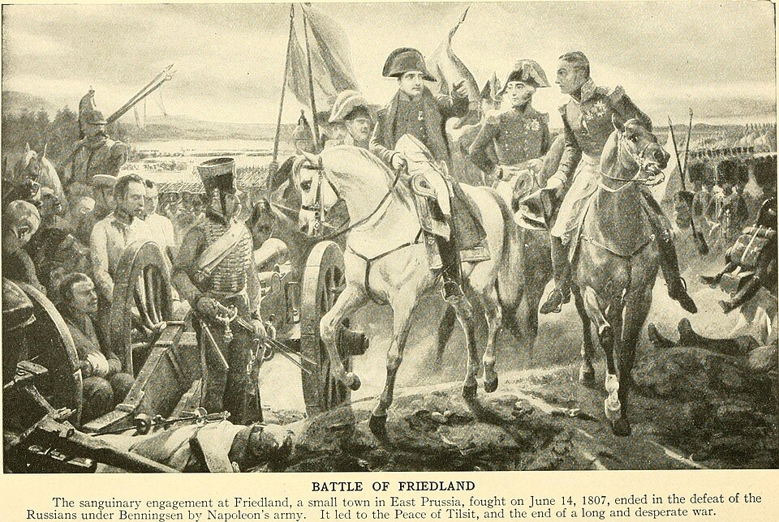

  

# armee-kinematics

Part of Armée, the Rust workspace for Marengo.

Loads joint limits and transforms from [`assets/urdf/marengo.urdf`](../../assets/urdf/marengo.urdf), aligned with [`hardware/docs/kinematics.md`](../../hardware/docs/kinematics.md). Used by planners, controllers, and sim collision checks.
