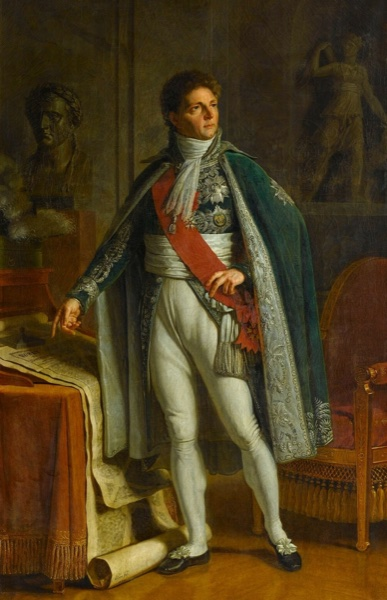

  

# berthier

Berthier runs the realtime control loop.

Trajectory tracking, mode switching, command output to motor drivers. Consumes planner setpoints from [Talleyrand](../talleyrand/) and limits from [Davout](../davout/).
