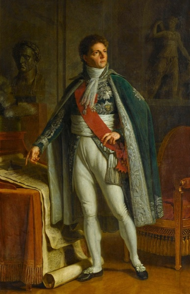

  

# berthier

Berthier runs the realtime control loop.

Trajectory tracking, mode switching, command output to motor drivers. Consumes joint setpoints (no planner crate exists; see [ADR 0014](../../docs/decisions/0014-jetson-perception-semantic-motion.md)) and limits from [Davout](../davout/).
