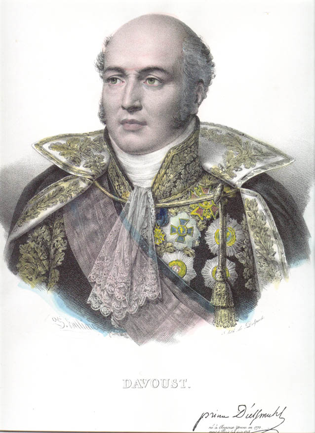

  

# davout

Davout is the safety layer.

It sits between [Berthier](../berthier/) and hardware: joint limits (URDF + kinematics docs), rate limits, fault reactions. Nothing reaches the motors without passing Davout.
