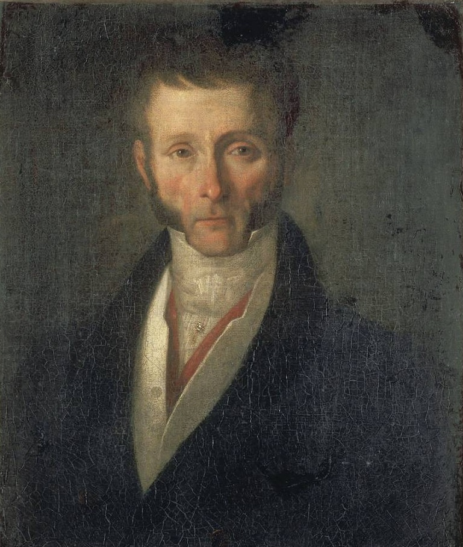

  

# fouche

**Fouché** — Jetson-side LLM and vision.

Runs on the Jetson: camera pipelines, ONNX policies in [`models/`](../../models/), and optional LLM tooling. Publishes perception and intent on [Chappe](../chappe/) for control and [Consul](../../consul/).
