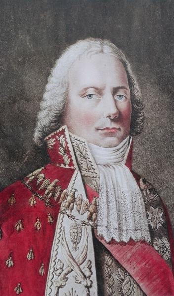

  

# talleyrand

Talleyrand is the motion planner.

It turns high-level goals into feasible trajectories using [armee-kinematics](../armee-kinematics/) and collision meshes under `assets/meshes/collision/`. Publishes setpoints for [Berthier](../berthier/) over [Chappe](../chappe/).
