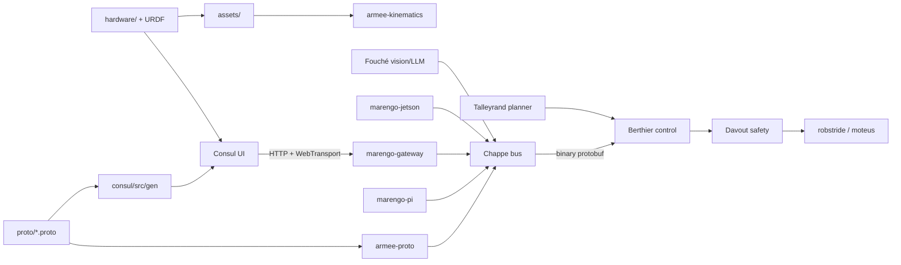

# Architecture

CAD, kinematics, and wiring describe the machine. The Rust workspace (Armée), message bus, control, safety, and planning consume that description. Scope and milestone order: [roadmap.md](roadmap.md).

Wire types are defined once in [`proto/`](../proto/) as Protocol Buffers and generated into Rust ([`armee-proto`](../crates/armee-proto/)) and TypeScript ([`consul/src/gen/`](../consul/)). [ADR 0001](decisions/0001-protobuf-wire-types.md).

## Data flow (high level)

## Control stack boundaries

Motor path is fixed: Berthier → Davout → robstride. Each crate documents its boundary at the top of `src/lib.rs`.

| Crate | Owns | Must not |
|-------|------|----------|
| [`berthier`](../crates/berthier/) | Joint-space trajectory executor: `tau_g` + impedance → MIT batch | CAN, limits, Cartesian IK, behavior scripts |
| [`talleyrand`](../crates/talleyrand/) | Cartesian primitives → joint trajectories (future) | CAN, MIT encode |
| [`davout`](../crates/davout/) | Enable FSM, filter, watchdog, send | Trajectories, URDF dynamics |
| [`robstride`](../crates/robstride/) | MIT encode/decode, CAN I/O | Policy, safety |
| [`armee-dynamics`](../crates/armee-dynamics/) | `gravity_torques(q)` | CAN, commands |
| [`armee-kinematics`](../crates/armee-kinematics/) | URDF limits, joint lists | Control loop |
| [`marengo-config`](../crates/marengo-config/) | YAML types/loaders | Runtime enforcement |

## Crates and binaries

See the root [README](../README.md#software) for the naming map (Napoleonic corps → subsystem).

## Dev tooling

[`dev-setup.md`](dev-setup.md): `protoc`, `buf`, and regeneration workflow.
