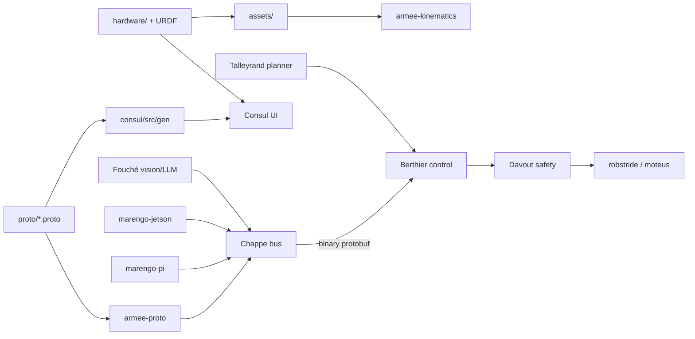

# Architecture

Marengo splits **hardware truth** (CAD, kinematics, wiring) from **software runtime** (Rust workspace **Armée**, message bus, control, safety, planning).

Wire types are defined once in [`proto/`](../proto/) as **Protocol Buffers** and generated into Rust ([`armee-proto`](../crates/armee-proto/)) and TypeScript ([`consul/src/gen/`](../consul/)). See [ADR 0001](decisions/0001-protobuf-wire-types.md).

## Data flow (high level)

## Crates and binaries

See the root [README](../README.md#software) for the naming map (Napoleonic corps → subsystem).

## Dev tooling

[`dev-setup.md`](dev-setup.md) — `protoc`, `buf`, and regeneration workflow.
