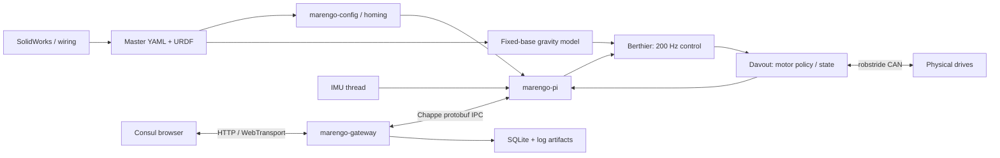

# Marengo repository and architecture review — September 29, 2026

Marengo currently implements a five-joint right bench arm with a real Pi control loop, CAN driver, safety supervisor, gateway, operator dashboard, and commissioning procedure. The software architecture has useful boundaries, but several executable safety guarantees fail under stale feedback, invalid commands, cancellation, and persistence failure. Those defects should be repaired before continuing the physical commissioning ladder.

The Windows working copy and local CAD are now at **`J:\code\marengo`**. The old Ubuntu checkout was 94 commits behind current main. Its local changes, ignored CAD files, alternate Windows CAD versions, and Git references have been preserved. Docker Desktop startup was repaired without resetting its virtual disks. Current development uses a Windows or macOS host checkout and Linux containers for Linux runtime checks; [ADR 0018](../decisions/0018-windows-macos-software-home.md) and [the host development guide](../windows-macos-development.md) describe that workflow.

This is a review and recovery record. The control, stop, freshness, calibration, and persistence defects below remain unresolved unless explicitly listed as fixed. Updating main and passing existing tests do not establish that the robot is ready for motion.

## Read this report in this order

**Implementation follow-up:** The
[complete implementation roadmap](2026-09-29/implementation-roadmap.md),
[102-ID ledger](2026-09-29/implementation-ledger.json), and
[test-quality audit](2026-09-29/test-quality-plan.md) now track repairs and
acceptance. Independent tests discovered CS23, a gravity COM translation defect,
and CS24, a stall fuse reset by a residual velocity filter tail, after this
review's original 100-ID inventory. The ledger distinguishes verified
repairs, partial work and outstanding findings; historical counts and validation
below describe the completed review baseline.

The [feedback/command repair](2026-09-29/batch02-feedback-command-validity.md)
adds public failure-path coverage and tracks CS01/CS03 admission fixes plus
partial CS04/CS14/CS15 validation work. Its current gate/review disposition is in
the ledger. Docker startup recovery was repeated after an unexplained Desktop
exit; the preserving workaround passed, while the initiating cause remains M08.

**Test-count clarification:** The baseline strict check's 582 passing Rust
executions included 84 fixture tests repeated before `cargo test --workspace`.
There were 498 workspace tests and nine ignored workspace cases; one ignored
fixture also ran twice. The implementation/test-quality plan removes that
redundant invocation while retaining full workspace fixture coverage.

1. The architecture and last bench checkpoint below rebuild the project context.
2. [The complete finding index](2026-09-29/finding-index.md) lists all 100 numbered findings across control, gateway, frontend, and tooling, including documented overlaps with its recommended fix.
3. [Control and safety](2026-09-29/control.md), [gateway and persistence](2026-09-29/gateway.md), [Consul](2026-09-29/consul.md), and [tooling/deployment](2026-09-29/tooling.md) provide source locations, triggers, reproductions, confidence, complete fixes, and regression-test recommendations. Their additional design concerns are part of the review too.
4. [Branch, PR, and issue reconciliation](2026-09-29/branches-and-issues.md) explains the disposition of old work. The execution ledger below records actions actually completed.
5. The ordered repair plan translates the findings into cohesive implementation work.

## Scope, baseline, and evidence

The primary code baseline is [`4bc77ba605834fdec04b436daa4bec67bca84fbb`](https://github.com/jaylamping/marengo/tree/4bc77ba605834fdec04b436daa4bec67bca84fbb), the main branch after PR182. Findings were checked on a clean review checkout, independently of the recovered August 8 feature checkout. Appendix links and line numbers are pinned to this baseline so later edits do not obscure evidence.

Parallel reviewers covered all Rust libraries and binaries, control/config/homing/IMU, messaging/gateway/logging/deploy state, frontend behavior, MCP and Python tooling, shell/install/deployment scripts, CI, simulation/CAD integration, and GitHub/branch history. Cross-cutting findings were reconciled rather than assumed independent. The audit inventory contained 104 remote references, including the remote-default alias, three open PRs, and seven open issues. The two legacy Windows DEAD checkouts were also checked: their 29 local branches, stashes and checkpoints contain four branches/eight commits absent from current refs plus dirty prototype worktrees; source-specific bundles and snapshots preserve that material, including 23 historical stashes and 20 checkpoint refs. Merged PR history and branch-tip differences were also checked; a matching merged PR name did not prove that its current branch tip was incorporated.

Evidence includes normal test suites, focused source-linked Rust and mocked frontend reproductions, isolated shell/tool tests, native Windows compilation, and Linux container checks. No Pi connection, deployment, physical CAN command, motor enable, robot movement, or CAD geometry modification was performed. SolidWorks models were inventoried and hashed; their mechanical geometry, mass properties, fit, wiring, and collision clearances were not physically or visually certified. macOS commands were reviewed but were not executed on a MacBook.

P1 denotes a concrete safety/correctness defect or a serious security/reliability failure that should block use of the affected workflow. P2 denotes a material bug to repair during normal development. P3 denotes lower-impact or dormant code debt. Evidence labels distinguish executed reproductions from source analysis and hardware-dependent claims. For example, NaN encoding proves a negative torque endpoint on the wire; actual motor torque depends on drive firmware and its configured limits.

## Architecture refresher

The repository is one robot project: CAD and wiring describe hardware; YAML and URDF describe the runtime model; the Armée Rust workspace controls it; Consul is the operator interface. Current workspace membership is **18 library crates and 10 binaries**. The codenames describe responsibilities, not separate deployed systems.

### Code map

| Area | Actual responsibility and useful starting point |
|---|---|
| `marengo-config` | Loads master YAML, maps joint/motor identity, validates supported fields, previews/resolves URDF joint-field merges. Start at `crates/marengo-config/src/`. |
| `armee-proto` | Generated Rust protobuf messages; `proto/marengo/v1/marengo.proto` also generates TypeScript. |
| `armee-kinematics` | URDF joint limits and safety envelopes. It is not a general FK/IK solver. |
| `armee-dynamics` | Fixed-base gravity torque by numerically differentiating potential energy. It is not full rigid-body inverse dynamics. |
| `berthier` | Control-loop orchestration, mode/gain runtime, MIT feedforward, PositionHold, position trajectory/lead/stall recovery. Start at `src/loop.rs`, `position_hold.rs`, `gain_runtime.rs`, and `mit_feedforward.rs`. |
| `davout` | Intended sole runtime motor-policy boundary: states, enable eligibility, limits, joint/motor transforms, filtering, disable/fault handling. Start at `src/lib.rs`. |
| `robstride` | CAN transport, MIT encoding/decoding, device registry, vendor commands. `bus.rs` and `mit.rs` are critical driver seams. |
| `marengo-homing` | Calibration registry and reference states; pure Hall logic. Physical GPIO/search/offset execution is incomplete. |
| `chappe` | Protobuf interprocess framing/pub-sub/IPC and tracing forwarding. Its implementation currently uses Unix-only types. |
| `marengo-imu` | Sensor protocol/acquisition and orientation telemetry. IMU orientation is not currently used to rotate the gravity model. |
| `marengo-host-metrics` | Pi CPU/disk/CAN/service diagnostics; several parsers need correction. |
| `marengo-store` / `marengo-candump` | SQLite session/log inventory, capture import/archive/query, CAN parsing. |
| `marengo-deploy` | Deployment/restart contract and state types; shell execution remains a major separate implementation surface. |
| `marengo-support` | Shared path/error/support helpers. |
| `sim-harness` | MuJoCo harness and fixture checks; current gate is not a production controller/model acceptance test. |
| `talleyrand` / `fouche` | Planning and perception library scaffolds; they do not yet provide a working humanoid planner or vision stack. |
| `marengo-pi` binary | Wires CAN, control, overlays, runtime commands, telemetry, and asynchronous persistence. Its main/overlay/persistence files are large orchestration seams. |
| `marengo-gateway` binary | Serves browser APIs/transports, config/hardware management, logs, restart/update operations. Many lifecycle rules live in bin modules. |
| `marengo-log-cli` / `marengo-limit-sync` | Offline log management and local checkout limit synchronization. |
| `motor-repl` / `imu-probe` | One-command bench motor CLI and sensor probe. `motor-repl` is not a persistent interactive controller. |
| `marengo-jetson` / `probe` / `wave-demo` / `teleop` | Jetson/experimental/demo entry points; their names should not be interpreted as completed perception, autonomous motion, or teleoperation products. |
| `consul/` | React/Vite operator application. Route config, telemetry hooks, compound playback, Hardware/import/reference panels, and Testing controls are the main behavior seams. |
| `tools/` / `scripts/` | MCP services, research/agent workflows, local synchronization, cross-build/deploy/install, audit and test gates. These can cross the physical-control/security boundary. |

### The active robot model

`config/robot.yaml` names the right bench chain in order: shoulder pitch, shoulder roll, upper-arm yaw, elbow pitch, lower-arm yaw. `config/motors.yaml` maps them to CAN0 IDs 1–5: RS03, RS03, RS02, RS02, RS00. Joint direction transforms matter; current pitch/upper-yaw/elbow/lower-yaw entries use -1 and roll uses +1. Confirm these from the installed configuration and hardware before physical work; this table is the repository snapshot.

The durable description is root `config/{robot,motors,control,homing}.yaml` plus `assets/urdf/marengo.urdf`, normally installed under `/opt/marengo`. Old bringup profiles are historical contributors, not independent current operator sources of truth. The recovered local four-joint URDF/CAD export must be reconciled with the five-joint master, not restored over it. Lower-arm yaw still has provisional limits and pending firmware metadata in the tracked config, even though historical execution records contain sign/reference checks.

The current dynamics model assumes a bolted fixed base and Z-down gravity. It omits nonconfigured joint angles by assuming zero and does not implement floating-base estimation, torso-oriented gravity, inertia/Coriolis/contact dynamics, or general prismatic/mimic behavior. These are intentional scope limitations to resolve as the robot grows. Missing or inaccurate URDF mass/COM is directly relevant to gravity compensation; polished UI geometry does not establish correct physics.

### Runtime and persistence rules

The Pi is intended to own physical control. A normal tick drains CAN feedback, computes gravity/control terms, forms MIT commands, passes them through Davout, transmits through Robstride, and publishes robot telemetry. Position mode includes substantial bench-tuned lead, friction, integral, damping, and stall recovery heuristics. GravityComp and TorqueOnly use hard-zero gains; current TorqueOnly is a distinct finite latched torque command after PR166, not the old GravityComp alias.

There are two different model-change paths:

| Operation | Current implementation |
|---|---|
| Numerical Set Limits | Changes live Davout policy while non-Active, then asynchronously persists motors/control/expand-only URDF. Pending means live acceptance, Durable means persistence completed, Failed means live and disk may differ. |
| General URDF Accept | Stages contributor bytes, previews supported joint-field conflicts, resolves choices, archives contributor/previous master, then promotes the merged file on disk. It reports restart required; the running Pi does not hot-reload the complete geometry/dynamics model. |
| Calibration/Set Zero | Firmware reference command plus registry state, but current verification, boot validity, and acknowledgements have defects. |
| SQLite logs | Observation/history; they are not the authoritative configuration or proof of action completion. |

Supported merge fields do not imply complete link inertial/visual/collision/topology merging. Read the revised CONTEXT glossary and gateway appendix for the exact seam. A failed activation response can occur after promotion; clients need an explicit applied checksum/generation rather than assuming disk stayed unchanged.

## Where physical commissioning stopped

The most recent execution evidence is [issue #170](https://github.com/jaylamping/marengo/issues/170), ending August 12. These are historical UTC records, not the present powered robot state:

| Checkpoint | Evidence and remaining limitation |
|---|---|
| Reference, sign, limits | Historical Reference/sign checkpoints passed for the bench arm. Fresh reference after power/config changes is still required. |
| Quiet arm-down gravity | Passed with notes. The float session exceeded upper-yaw hard limits; elevated gravity was not green. |
| Elevated / Wave pose | Elevated drift was pitch -0.105 rad, yaw +0.164, elbow +0.413. A later Wave-pose checkpoint was accepted with notes, but pitch +0.076 rad exceeded the strict <0.05 dwell bar. |
| 25% Position ladder | Passed on the later ascent/stall-recovery implementation, with breakaway/jerk observations. |
| 50% Position ladder | On `4bc77ba`, pitch hang was fixed, but roll return failed: requested ~0.20 rad was envelope-clamped to ~0.382 at shoulder pitch ~1.39, and settle timed out. The retry was incomplete and explicitly not scored. |
| Wave smoke and sign-off | `WAVE_POSE_GCOMP_SIGNED` remains false. [Issue #176](https://github.com/jaylamping/marengo/issues/176) requires the current live raise + elbow-wave smoke. |
| Final stop note | The latest comment, 04:07:57Z, corrects the preceding stop claim: remote disable/process termination was **not confirmed** after Tailscale connectivity loss. |

The remaining procedure includes a valid 50% retry, higher rungs, near-limit and later chapters/payload/sign-off work. First repair the software safety defects, then re-establish hardware/support/reference state and resume the locked [limb playbook](../commissioning/limb-playbook.md). Avoid resuming from old suite instructions, assumed reference validity, or a historical “PASS with notes” as full acceptance.

## Highest-priority findings

The complete index and appendices contain the full fix list. These groups have the strongest consequence for the next bench session:

| Failure | Why it matters | Required repair |
|---|---|---|
| CS01: empty CAN drains refresh the watchdog; one motor can mask another | Cached pose can remain usable indefinitely after feedback stops. Actual MemoryBus reproduction accepted a command after the configured timeout. | Per-address receive timestamps, all-active-joint freshness, finite feedback validation, bounded enable bootstrap, explicit fault telemetry. |
| CS02/03/10/11: torque cap/slew/nonfinite/PD contract | A 5 Nm feedforward cap can produce 7.4 Nm after slew; NaN encodes a wire extreme; PD torque is outside the software feedforward cap. | Reject invalid values at every boundary; hard clamp after transformations; constrain gains/total torque policy; verify drive limits and timeout behavior. |
| CS04/13: fault decode and latching | Driver flags are dropped/truncated or overwritten, and software fault telemetry can clear before observers see it. | Full vendor decode, normalized latched faults, explicit operator reset and re-enable barriers. |
| CS05/06 + F14/23: reference validity and Set Zero receipts | A historical joint-name row can make a changed/power-cycled joint Verified; old cached near-zero feedback can validate a new command; UI says Applied for queue success. | Hardware/model/boot-bound calibration, post-command sample/ACK verification, teach invalidation, pending/refused/verified receipts. |
| F01/02/03/04/07 + CS07/08/09/12: stop and command lifecycle | Browser timers can re-enable after Disable; Dry Run can bypass admission; Hold Stop sends no stop; disable errors are hidden and persistence can delay shutdown. | Runtime motion ownership/lease, generation-based cancel and stop barrier, explicit enable only, immediate safety action with truthful transport outcome. |
| G04/05/06/08/09/21: configuration and management authority | Coalescing loses writes/ACKs, failure state can clear incorrectly, stale/unknown state authorizes management, and live/disk no-op or import transactions can lie. | One writer and config-generation authority, complete coalescing/receipts, real runtime safe-stop handshake, fail-closed management, recoverable transaction protocol. |
| F05/06 + G10: apparently healthy stale/fabricated state | A connected gateway is not a fresh robot; some status labels come from fixtures. | Carry boot identity, source timestamps, age and authoritative state; render Unknown/Stale honestly and gate motion accordingly. |
| G07 and tooling command/install surfaces | Legacy motion routes bypass the configured token; local sync and writable privileged helpers expose mutation/execution paths. | Consistent server-side auth/origin handling, bounded inputs, shell argument allowlists, immutable privileged helper parents, one physical bus owner. |
| G01/02/03: telemetry queue, log rate window, retention deadlock | Outages can cause unbounded memory; low-severity logs stop after 40 events; old-session retention hangs. | Bounded queues/backpressure, real rate-window clock, deadlock-free retention, outage/concurrency regression coverage. |

Read the tooling appendix for its separately numbered findings. It includes deployment preservation, competing control processes, shell injection, research failures, host portability, simulation/model mismatch, dependency advisories, and missing integration gates.

## Recommended implementation plan

These are recommended follow-up changes, not fixes already performed by this audit. Grouping related defects makes their guarantees testable at one boundary.

### 1. Close the motor safety boundary

Fix CS01–CS04 and CS08/10/11/12/13/15 together at the Davout/Robstride seam. Require finite feedback/commands/config, complete normalized vendor faults, per-motor freshness, legal post-filter torque/gain envelopes, and explicit reset/re-enable policy. Disable should attempt all drives and return a per-drive outcome; a failure must remain visible. Reject invalid policy before starting a runtime.

Add source-linked tests for empty drains, one silent motor, unknown-only CAN traffic, old cached samples, NaN/Inf/negative gains, above-cap slew seeds, cap changes, faults followed by normal status, and partial CAN send failures. Verify drive-side current/torque limits, feedback meaning, watchdog, zero persistence, and fault bits against the installed model/firmware before claiming physical guarantees.

### 2. Give motion one runtime owner

Introduce a small backend MotionSession interface owning admission, operator identity, boot/run ID, command generation, lease/TTL, phase, completion, cancel, and stop. Browser hooks should request a run and observe authoritative progress. Gain edits should not silently replace a pose/mode. Cancel must invalidate every older timer/queued command and cannot implicitly enable. Define cancel, stop, disable, and emergency latch as separate operations with explicit gravity/support policy.

Repair F01–F04/07, CS07/09/19/20, and tooling process ownership together. Stop safety action must precede persistence waits. MCP/CLI tools should use the authorized runtime rather than launch a competing CAN owner; exclusive bus ownership needs enforcement as well as documentation. Regression tests should simulate disable during delayed playback, multiple tabs/tools, unmount, Dry Run changes, late POST completion, native finite-wave completion, gain-only changes, and shutdown failure.

### 3. Make reference and configuration transactions authoritative

Build a PiConfigAuthority around the actual live configuration/model/calibration generation and one durable writer. Aggregate pending motor/control/URDF changes without discarding fields and return a terminal receipt to every requester. Use opaque IDs plus boot/generation identity, client edit CAS, and immutable transaction records. A Durable disk no-op must not conceal a divergent live revision. Restart/update/import must negotiate a fresh runtime safe state and block on degraded persistence unless an explicit recovery operation resolves it.

Bind reference to actuator/interface/firmware, transform/model revision and encoder boot/zero validity. Verify Set Zero with a new correlated feedback/firmware result. Coordinate UI taught-coordinate invalidation with the same generation protocol. Resolve CS05/06/16, G04–G09/G21, F14/16/20/22/23, and deploy taught-limit preservation in this pass. Test concurrent requests, coalescing, every ACK, crash/restart, disk/rename failure, unknown Active state, failed no-op restoration, and competing URDF writers.

### 4. Establish truthful telemetry and reliable observation

Fix G01/02/03 first because diagnostics are essential to validating later physical repairs. Define bounded, prioritized telemetry/log queues and explicit drop counters. Carry original per-source timestamps and boot identity; never relabel cached IMU/robot samples as current. Supervise transport tasks and required listeners, handle HTTP abort/reconnect/StrictMode lifetime, and render stale/unknown hardware states rather than fixtures.

Repair CS17/18, F05/06/08–F10/17, G10/12/18–G20 and related log-loss concerns. Add outage, blocked writer, reconnect, certificate lifecycle, burst-severity, malformed sensor packet and parser-fixture tests. Dashboard status should expose last receive age, installed/live model revision, persistence state, reference, mode, and current run identity.

### 5. Repair historical data and tool/deploy boundaries

Fix G13–G17: non-destructive artifact upserts, parsed source capture dates, transactional migrations, bounded streaming/blocking I/O, and checked timestamp conversion. Correct archive request ordering/paging and actual update target matching in F18–F20. Store root-relative artifact identities and support verified relinking on restore/move. Implement one retention/budget policy and record actual writer failures.

For tooling, protect root-owned helpers and every ancestor directory, fail deployment before replacing taught limits when preservation fails, sanitize shell commands, add local-sync authentication/origin checks, and use an isolated pinned build snapshot without switching the user's branch. Repair research async/cache and arXiv API compatibility. Keep test reproductions local and harmless until converted to regression tests for the repaired behavior.

### 6. Complete model and platform verification

Keep the host workflow at J on Windows and a normal Mac checkout. Full native Windows Rust requires a Chappe transport seam, e.g. Unix domain sockets behind a Unix implementation and an authenticated local Windows transport behind the same bounded protocol. Test platform compilation separately from Pi CAN/I2C integration. Correct macOS Bash/GNU-tool assumptions before calling native deployment portable.

Generate or validate simulation against the current production URDF/config, joint names/transforms, mass/COM, and control policy. Repair the ignored dynamics goldens using independent analytical oracles; do not merely update expected numbers to match the implementation. Extend CI to meaningful Python/MCP/shell/preservation/compound behavior, failure injection, model consistency and Windows compilation. Distinguish pure CI acceptance, vCAN, simulation and operator-assisted physical commissioning. General humanoid FK/IK/planning/perception should follow a demonstrated need and accurate models.

## Migration, backups, and Docker repair

The source copy preserved 6,680 files (about 4.263 GiB), including ignored CAD and Git metadata. SHA-256 verification compared **6,678 files / 4,577,458,206 bytes with zero mismatches**, excluding the intentionally changed Git config/index and regenerable caches. Four missing CAD files were recovered from the older J checkout; differing versions from both J and C older checkouts were preserved separately. Identical versions were not duplicated into the active CAD tree.

Recovery directory: `J:\code\marengo-migration-backup-20260929`. It contains source/hash and CAD manifests, pre-migration status, recovered tracked/untracked archives and readable files, all-ref Git bundles, the old empty Windows metadata/cache, and alternate CAD versions. The dirty checkout was saved with a tagged stash, `recovery/windows-migration-20260929`; the old feature branch and original sources remain. Git bundles preserve Git objects, not arbitrary ignored CAD or LFS bodies. The final legacy-Windows recovery also saved two independently verified all-ref/reflog bundles, all 23 stash patches/readable files, 4,912 SHA-verified worktree copies (2,456 per source), and a deduplicated 440-object LFS cache of 1,045,184,082 bytes. [The full preservation ledger](2026-09-29/branches-and-issues.md#legacy-windows-branches-worktrees-and-stashes) records semantic verdicts and two absent physical worktrees whose commits/admin metadata were retained.

The unique historical shoulder bracket from closed PR41 was separately fetched from LFS, verified as 1,707,374 bytes with SHA-256 `3e401d6748429e0015c359e072436f66e2a5dbc54d0180639b6e8d26a269fb65`, and saved under the backup's `historical-cad-pr41/`. It did not replace the different current local part.

The old `C:\code\marengo` was only an empty Git/cache placeholder. Its remaining metadata was moved into the J-drive recovery directory. The now-empty C task folder is held open by this session. Open **`J:\code\marengo`** as the working project. The original WSL tree was renamed to `\\wsl$\Ubuntu\home\joey\code\marengo.recovery-20260929`, so its former active path no longer exists. It and the older `.DEAD` trees remain recovery sources; their deletion was not performed. Unrelated Rudy/other project directories were not reconciled into Marengo. Ignored SolidWorks files need an explicit backup/vault policy; a Git push or Mac clone will not transfer them.

Docker failed before accessing any Marengo checkout or container. Both supplied startup errors pointed to stale NTFS Unix-socket entries from September 11: the Inference-manager socket under Docker's `run` directory and Secrets Engine's `engine.sock`. Their runtime parent directories were preserved under timestamped names and recreated. The startup then succeeded. Docker settings, the 152,992,481,280-byte data VHDX and 125,829,120-byte engine VHDX were preserved; before Marengo checks, 12 existing containers, 12 images and 236 volumes were recovered. Later checks add normal Marengo cache/image resources.

The evidence supports stale runtime sockets as the immediate failure, predating this repository migration. It does not prove the original cause of those stale entries. Full local repair evidence, before/after inventory, disk metadata and the read-only startup harness are in the migration backup. No factory reset, virtual-disk deletion or unrelated-project mount change was used.

## Branch and issue execution ledger

| Item | Completed disposition |
|---|---|
| Latest main | Recovered checkout advanced 94 commits to the reviewed current main. Local dirty edits remain recoverable rather than overlaid on the five-joint model. |
| PR107 | Corrected Hardware staging/resolve/archive/disk/restart glossary and final recovery ledger independently reviewed, then updated onto the verified maintenance main. [CI and merge record](https://github.com/jaylamping/marengo/pull/107). |
| PR109 | Closed as superseded design prototype. Current production Hardware already implements the selected surface; branch/history preserved. |
| PR117 | Closed as superseded; all nine glossary rows already landed through PR119. |
| Issue118 | Closed as implemented by the Hardware/commissioning UI cutover. Current correctness defects are recorded here. |
| Issue115 | Closed as an older duplicate with an explicit body note linking later Reference/sign/quiet arm-down evidence to170 and preserving the unresolved elevated/ladder/Wave work. |
| Issues96,150,170,176 | Remain open because contract acceptance or physical execution remains incomplete. |
| Issue63 | Remains deferred WebGPU work; no measured requirement or implementation warrants a merge. |
| Research/prototype/Auto Learn branches | Reviewed and preserved. Unique dated research needs annotated restoration; duplicate research content identified. The old Auto Learn branch's Wave unlock and obsolete model changes were rejected for bulk merge. |
| Merged-history tips | Four branch tips differed from merged PR heads; two are subsumed, two contain unique docs/deploy intent retained in the backup and repair recommendations. |
| Legacy Windows work | Both DEAD source histories and dirty prototype worktrees reviewed and preserved separately; unique historical model/documentation/prototype snapshots are recovery evidence rather than current five-joint configuration. |
| Branch deletion | No bulk deletion. The detailed ledger explains preservation and remaining semantic dispositions. |

## Fixes made during this review

- Changed the declared software/CAD home, setup guides and agent hooks to the J host checkout; superseded the WSL-home ADR.
- Changed repo MCP launches to Node with workspace-relative paths.
- Made Compose check entry commands explicitly invoke Bash and shared the existing named build caches with auxiliary checks; scoped container Git trust to the mounted checkout so ownership cannot turn the hook consistency check into a comparison between unrelated files.
- Added the Consul behavioral suite to the primary check gate. Fixed the four baseline route-index test failures and a reproduced cold lazy-import timeout; route/product behavior was not changed by those test repairs.
- Corrected the Windows MCP shell-path test; native Pi-MCP tests now use Git for Windows `sh` rather than accidentally invoking the WSL launcher.
- Patched the locked h2, rustls (and required TLS transitive packages), and anyhow versions for current RustSec advisories; direct dependency declarations are unchanged. Two unmaintained-package warnings remain.
- Refreshed the Consul lockfile within existing dependency ranges. The checked audit now has no high/critical advisories; two moderate React Router advisory package entries remain and need a deliberate major-version/applicability review.
- Reconciled glossary PR107 and closed superseded PRs/issues with preserved history.
- Repaired Docker startup and preserved/verified the migrated data and historical CAD.

No control-policy, robot mode, torque cap, firmware setting, calibration record or Wave sign-off was changed by these maintenance fixes.

## Validation and limits

The audit's baseline validation included 219 passing portable control/config/dynamics/driver tests with nine ignored cases; 36 passing gateway/store/candump/deploy tests; and 13 isolated frontend behavior reproductions. Seven of eight independently exercised ignored dynamics cases failed, indicating stale/mismatched oracle/model expectations that require investigation. These are separate invocations, not a summed unique test count. Native Windows Chappe compilation failed on Unix-only types as documented.

The maintenance changes passed 355 frontend tests and 72 Pi-MCP tests on the native host, plus tooling typechecks/build and Rust formatting. The new frontend gate exposed and reproduced the lazy-import timing failure in Linux before its timeout repair. The strict CI-mode container gate passed with 582 Rust tests, ten ignored cases, 355 frontend tests, 72 Pi-MCP tests, clippy, formatting, cargo-deny, cargo-audit, protobuf/build checks, and a successful aarch64 release cross-build. Cargo-audit has two allowed unmaintained warnings (paste and rustls-pemfile); Consul retains two moderate advisory package entries, and Pi-MCP/compound tooling dependency advisories remain in the tooling appendix. Their audits are not all enforced by the primary gate.

Physical sign/reference, E-stop circuitry, hardware feedback/watchdog/torque saturation, CAD inertials, macOS execution and full production-model simulation remain outside this audit's executed validation. The complete appendices specify regression tests needed to demonstrate each recommended repair.

### Final validation and merge record

- Strict Linux container check: **PASS**, including current dependency patches and successful aarch64 cross-build; log preserved in the migration backup as `strict-check.log`.
- MuJoCo `just sim-check`: **PASS** on its configured minimal fixture; this does not validate production dynamics/control integration.
- Local `just check-vcan`: **BLOCKED** by Docker Desktop kernel vCAN support (`modprobe failed and cannot create vcan link`). Temporary local test containers were stopped/removed. The earlier GitHub vCAN job for rewritten PR107 passed.
- PR107's first check exposed the old Consul lockfile's high advisories. Its branch was then updated onto the patched, verified main; [the PR record](https://github.com/jaylamping/marengo/pull/107) contains the final fresh checks and merge state.
- Maintenance [PR212](https://github.com/jaylamping/marengo/pull/212) merged as `2f1ca4c` after all five jobs passed: primary check, Linux vCAN, simulation, image and change detection. The final glossary/preservation update is [PR107](https://github.com/jaylamping/marengo/pull/107); fresh required checks precede its merge.
