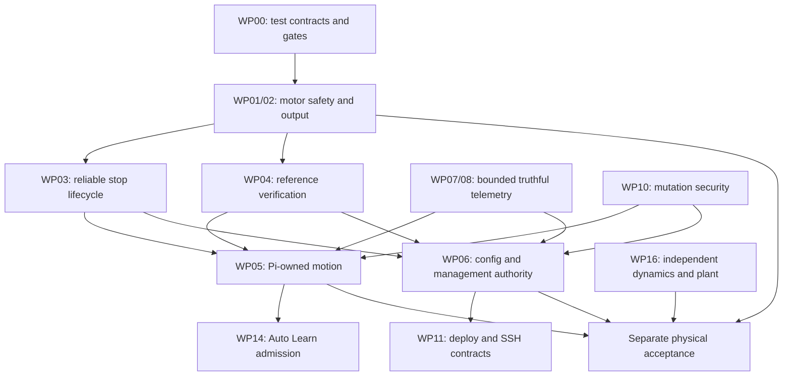

# Marengo implementation roadmap

Started September 29, 2026 from main `52f12678277a2cae786d8df648f035895789f026`.
Active Windows checkout and local CAD: `J:\code\marengo`. All review/recovery
records remain under `J:\code`; no development checkout is moved into Ubuntu.

This is an implementation plan and progress ledger, not a claim that every
finding is repaired. The original review contained 100 IDs. Independent analytic
tests discovered **CS23**, bringing this plan to **101 IDs**. CS22/G11 and G10/F05
are explicit cross-layer overlaps. Tooling findings also intersect runtime work;
ID counts do not count independent defects.

## How to use the plan

The [machine-readable ledger](implementation-ledger.json) assigns every finding
one primary work package, current disposition, source and verification record.
The [finding index](finding-index.md) preserves the original evidence and full
recommended fixes. Detailed design and acceptance criteria are in the
[control plan](control-implementation-plan.md),
[gateway plan](gateway-implementation-plan.md),
[frontend/tooling plan](frontend-tooling-implementation-plan.md), and
[test-quality audit](test-quality-plan.md).

Status `verified` means the described software repair has direct evidence and
required checks. `partial` means a useful subproblem is repaired but the finding
stays open. `implemented` awaits the required integrated gate and review. `open`
means no implementation is complete. An overlap references
its canonical finding but must still be validated in every affected layer.
Hardware acceptance is tracked separately, never inferred from software tests.

Each repair batch follows this sequence:

1. State the observable invariant and the exact interface that owns it.
2. Reproduce the failure with the actual implementation and an independent
   expected outcome. Use bounded failures and deterministic clocks, not sleeps
   or source-string checks where behavior can be exercised.
3. Repair the smallest complete slice. When ownership is the problem, rewrite
   that module and migrate callers rather than add another flag or wrapper.
4. Run focused tests, inspect the diff, then run the required primary gate.
   Review safety/protocol changes independently. Record the red/green evidence,
   scope limits and any changed physical model output.
5. Update the ledger, retire superseded code/tests, and merge only a verified
   change. Pick the next dependency-ready package. Do not accumulate unrelated
   fixes in a long-lived branch or close issues from documentation alone.

## Repair order and dependency graph

Work packages are delivery slices, not a proposal to create seventeen new crates.
Subdivide a package into reviewable PRs using its per-finding acceptance criteria.
Independent repairs can proceed together with disjoint edit ownership.

Logging/storage (WP09), portable builds (WP12), dependencies/TLS/render lifecycle
(WP13), and research repair (WP15) can proceed without waiting for motion design.
All software packages require meaningful tests from WP00; that package is a
continuing quality rule rather than a blocker requiring a giant test rewrite.

| Package | Findings | Change and completion contract | Prerequisites |
|---|---|---|---|
| WP00 Test contracts and gates | T21, T22, T26 | Replace false source-shape audit alarms and invalid scanner flags; execute Python, shell, Compound and advisory checks in the appropriate gate. Classify tests by independent contract and measure compile/install versus execution. Failed scanners must report failure, not success or an invented vulnerability. | None; applies throughout |
| WP01 Feedback, validity and faults | CS01, CS03, CS04, CS12, CS13, CS15 | Davout accepts a validated policy, rejects nonfinite/negative-gain input, expires each active drive from real decoded RX, and latches complete vendor/runtime faults. Empty drains, unknown traffic or another motor cannot refresh a silent drive. Invalid batches produce no motion frames. Fault/reset/enable are explicit. | WP00 |
| WP02 Legal output and limits | CS02, CS10, CS11, CS14, CS16 | Hard cap wins after every filter; limiter state has a defined enable/disable lifecycle. Define and test total PD+FF torque admission, measured-pose limit edits and typed danger responses. Preserve existing ceilings and gravity-support requirements. Verify drive-local limits separately. | WP01 for full admission; cap slice independent |
| WP03 Stop lifecycle | CS07, CS08, CS09, F07, T05, T12 | One owner attempts all disables, reports per-drive failures/uncertainty, and stops before persistence waits. First software E-stop activation reaches the runtime and latches; old CLI/deploy process kill paths cannot create a second CAN owner. Stop helper success requires observed termination. | WP01/02, WP10 |
| WP04 Reference transactions | CS05, CS06, F14, F23 | Bind calibration to hardware/config and current boot; Set Zero awaits postcommand evidence and yields a verified receipt or timeout. Reference changes invalidate taught poses. A queued response cannot be shown as Applied. | WP01, WP03 |
| WP05 MotionSession | CS19, CS20, F01-F04, F11-F13 | Replace browser-owned live playback and one-shot local mode changes with Pi-owned sessions, lease/boot/run generation and acknowledged completion/cancel. Disable invalidates old commands before returning; gain-only updates cannot retarget. Preview execution has its own deterministic completion and cannot switch to live in-place. Wave gates remain closed until physical acceptance. | WP01-04, WP07, WP10 |
| WP06 ConfigAuthority | G04-G06, G08-G09, G21, F16, F22, T02-T03 | One writer owns complete live/durable generations and all waiters. Failed persistence remains degraded; unknown/stale state refuses management. CAS prevents competing promotions; precommit validation plus recoverable receipts distinguish committed from uncommitted failures. Deploy preservation must succeed before replacing/restarting. Local mirror is bounded and optional to Pi durability. | WP01, WP03/04, WP07, WP10 |
| WP07 Transport and truthful state | G01, G10, G20, F05-F06, F08-F10, F15, F17, F20 | Bounded cancelable IPC; producer boot/time/age and authoritative facets; supervised listeners; complete stream cleanup/reconnect; stable WebGL scene lifecycle; severity-aware decode and matching deployment job identity. An open gateway stream cannot imply a fresh Pi or successful unrelated job. | No dependency for resource fixes; identities coordinate WP05/06 |
| WP08 Sensors and diagnostics | CS17-CS18, G18-G19 | Original IMU sample age survives publication/reset; captured BNO085 batches retain report alignment. Parse documented CPU/network/mount fields and return unknown when collection fails. | None |
| WP09 Logs and archives | G02-G03, G13-G17, F18-F19, F24-F25 | Refillable tracing quota, deadlock-free retention, transactional schema/recovery, preserving artifact/date import, bounded worker/file/parse costs, real page/filter semantics, cancellation against wrong-session results and truthful time units. | None; bounded executor coordinated with WP07 |
| WP10 Security of mutations | G07, T01, T04, T06 | Shared fail-closed server auth, runtime credentials, origin validation and bounded request bodies; root-owned helper parents; typed command arguments without shell substitution. Use harmless local injection fixtures and foreign-origin loopback tests. | None; prerequisite for trustworthy clients |
| WP11 Deployment and SSH results | T07-T11, T13-T14 | Propagate structured exit/error/timeout outcomes; validate motion wait duration; build isolated pinned revisions without changing the operator checkout; distinguish source tree from installed runtime and resolve executable paths consistently. Execute scripts against fake SSH/systemd/file fixtures rather than compare strings. | WP03, WP06, WP10 |
| WP12 Host portability | CS22/G11, T15-T16 | Split portable bus/framing from the Unix adapter; explicit unsupported transport if a native backend is absent. Windows/macOS portable tests compile; Linux checks retain real SocketCAN/I2C. Mac shell/hash tools have supported prerequisites. Host source and CAD stay under J on Windows. | None; preserve wire/protocol behavior |
| WP13 Dependencies and lifetimes | G12, F21, T31-T32 | Renew TLS keys/fingerprint coherently; retain stable route tests; patch remaining tool advisories with compatible versions; handle Router major migration deliberately and prove affected behavior. Render lifecycle F15 is owned by WP07. | None; consult SDK instructions for Compound upgrades |
| WP14 Auto Learn | T23-T25 | Require complete finite live joint limits/context, predecessor stage evidence and continuous trajectory velocity bounds. No incomplete model or empty prior can bypass admission. Motion requests use the same runtime owner and fail closed. | WP01, WP05/06/07, WP10 |
| WP15 Research tooling | T17-T20 | Await all asynchronous cache-miss handlers, use the installed arXiv client contract, preserve explicit zero scrape count and real week/month recency. Mock only external network boundaries and check returned content. | None |
| WP16 Model and plant validation | CS21, CS23, T27-T30 | Immutable analytic gravity fixtures, correct COM point transforms, production URDF/MJCF provenance and independent cross-check; deterministic production-controller plant tests cover delay, dropout, saturation, stiction and cancellation. Reject incomplete pose input and unsupported model/export capabilities; scaffold commands cannot report success. | Analytic checks immediate; integrated plant after WP01/02/05 |

## Rewrite decisions

[ADR 0019](../../decisions/0019-runtime-authority-and-verification.md) records the
target ownership and migration rules. The detailed plans identify actual files
and public interfaces. The likely substantial rewrites are:

- Pi command/overlay lifecycle and the browser compound runner: one MotionSession
  replaces competing timers, implicit enables and transient flags.
- Pi limit persistence plus gateway import/management lifecycle: one
  ConfigAuthority replaces whole-request overwrites, parallel writers and global
  Pending/Degraded booleans.
- Davout admission/output/state internals: a validated private policy and explicit
  receive/fault/stop state replace invariants that rely on a caller's ordering.
- Chappe transport lifetime and bounded fanout, with portable framing independent
  of the Unix adapter; keep the protobuf protocol rather than invent a second bus.

Keep the checked Robstride codec, independent dynamics and useful PositionHold
contracts unless their invariants demand a replacement. Do not rewrite empty
planning/perception scaffolds to satisfy unrelated findings. PositionHold changes
need an independent plant; replaying the planner as measured feedback is not an
acceptance oracle.

For each rewrite, add the new owner at the existing seam, migrate every active
caller, demonstrate the old path is gone, and remove old private/helper tests
after their behavior is covered. One live CAN owner and one durable writer are
cutover conditions, not aspirations left for a later PR.

## Test validity and development cost

The previous strict gate reported 582 passing Rust executions (498 workspace
tests plus 84 repeated fixture tests), 355 frontend and 72 Pi-MCP tests. It
did not catch the identified watchdog/NaN/stop/ownership defects. Counts and
passing snapshots are not acceptance criteria. The test audit supplies exact
keep/replace/consolidate candidates; tests are not deleted just for being small.

The previous cached Docker check spent 9.78 s compiling Rust tests and about
1.40 s summed in Rust test binaries; frontend Vitest took 10.45 s. Dependency
installation, browser module import/DOM setup, bundling and cross-compilation
cost more than most assertions. A fresh native Windows Vitest run passed
355/355 but took about 68.72 s to its final file versus 7.20 s summed assertion
time. This single observation does not establish a disk or operating-system
cause. Benchmark the same environment/cache before claiming a speedup.

Use three verification levels:

1. **Edit loop:** affected public-interface regressions and formatter/type checks.
   Deterministic clocks and event completion replace wall-clock sleeps. Pure
   frontend tests use a Node environment; DOM tests cover actual interaction.
2. **PR gate:** required `just check`, meaningful Python/shell/Compound checks,
   protocol compatibility and Linux vCAN/sim gates when their paths change.
   Preserve compile/build/lint/security checks; do not label their cost as tests.
3. **Model/runtime acceptance:** independent plant and production-model parity,
   then separately supervised physical commissioning under the locked playbook.

Initial targets are a warm focused edit loop under 10 s and stable regression
test bodies under 2 s per ordinary suite. These are planning budgets, not measured
guarantees. Large-file/outage/concurrency tests use bounded inputs/deadlines and
run at the PR/integration tier. Do targeted mutation checks for high-consequence
invariants instead of imposing full-workspace mutation testing on every edit.

## First batch and evidence

Review and delivery: [PR213](https://github.com/jaylamping/marengo/pull/213).

The first batch implements CS02/CS11, G02/G03 and the newly discovered CS23.
CS21 is **partial**: its eight ignored stale golden/private-cache checks are
replaced by four active analytic public-interface tests; current-master
independent model/plant validation remains required.

The full gate also exposed two legacy Berthier tests that assumed
`sign(tau_g) == sign(q)` for a laterally offset archived arm. They are replaced by
one geometry-specific public dynamics test with independently derived mass
moments. Its torque at q=0 is -1.18701 Nm, not zero. This retains meaningful
historical-fixture coverage while removing the misleading general sign rule.

- Torque regressions exercise real Supervisor/MemoryBus wire output in both
  polarities, lowered caps, first activation and disable/re-enable. Original
  failures include 7.4 Nm output under a 5 Nm cap and stale limiter replay.
- Log quota tests publish through the real tracing layer/Bus using a controllable
  monotonic clock. Original code forwards zero events after the first exhausted
  window; the repaired window forwards the next admitted events.
- Retention uses a bounded child process to reproduce the old deadlock, then
  verifies public Store state and artifact outcomes after expiry.
- Analytic two-link gravity tests fail on the original COM-vector calculation:
  expected shoulder holding torque 46.5975 Nm, actual 17.1675 Nm. COMs are now
  transformed as points, including joint-origin translations. Single pendulum,
  coupled links, rotated origin and configured joint order are independent
  oracles. This changes production gravity output; old bench results must not
  serve as acceptance of the corrected calculation.

Raw red/green logs and test-timing JSON are preserved under
`J:\code\marengo-migration-backup-20260929`; portable acceptance descriptions
and test sources live in the repository. The ledger records the successful strict gate and two independent reviews:
**507 workspace Rust tests passed, 1 ignored; 355 frontend and 72 Pi-MCP tests passed**.
Format, clippy, proto/build, cargo deny/audit and aarch64 release checks pass.
The local full check additionally repeated 84 fixture tests and the same ignored
kinematics placeholder. The primary script no longer invokes that redundant
precheck; the complete workspace fixture coverage remains. Required GitHub PR
checks validate this final script before merge. Linux vCAN runs separately with
its transport feature. None of the analytic gravity tests are ignored.

## Second batch: feedback and numeric admission

The [second batch report](batch02-feedback-command-validity.md) records the
CS01/CS03 receive-time and command admission repair, with CS04/CS14/CS15 still
partial, delivered in [PR214](https://github.com/jaylamping/marengo/pull/214).
Real baseline regressions catch empty drains, silent peers, NaN becoming
the RS03 -60 Nm wire endpoint, invalid policy, overlay/gain mutation, nonneutral
startup output, re-enable between ticks, queued enable status and taught ranges
excluding zero. Independent review and the primary gate pass: 547 workspace
Rust tests (one ignored), 355 frontend and 72 Pi MCP tests. Required GitHub
checks remain recorded separately before merge. Cargo deny's yanked-crate
registry coverage warns and remains unknown; T26 records the gap.

Four shallow/unused driver tests are replaced by public raw-wire and failure
matrices. Existing controller replays now supply status for stationary enabled
peers; their meaningful planner/stall assertions remain. This batch does not
complete fault latching, stop confirmation, reference verification or config
generation ownership. Docker's stale runtime socket error recurred and the
preserving recovery passed; M08 retains the unexplained initiating exit and
upstream Windows socket dependency.

## Completion and continuation

The active thread heartbeat **Marengo repair loop** continues every 30 minutes
from this ledger. Each run reconciles current Git state, completes the next
dependency-ready reviewed slice, records test evidence and updates status.
Follow-ups never operate or deploy to the physical robot. Pause/finish the loop
when software work is complete or a specific external decision blocks progress,
and report the remaining acceptance gates.

Software completion requires a disposition for all 101 IDs, all required callers
migrated, meaningful regression coverage and passing required checks. Do not
declare completion merely because P1s are fixed or an existing suite is green.
Retire dormant code only after checking its consumers and preserving required
behavior; a removed capability must report unsupported rather than pretend it
works.

The ledger also tracks architectural and maintenance tasks beyond numbered bugs:
unmaintained `paste`/`rustls-pemfile`, drive-local timeout/limit handshake,
E-stop/Hall input implementation or explicit refusal, wrong-sign frame policy,
unsupported/cyclic/invalid model rejection, bounded realtime work and model/CAD
provenance. These cannot disappear just because T32's exploitable advisories were
patched. Hardware execution and acceptance remain separate recorded requirements.

Physical release remains gated on fresh reference/sign checks, verified installed
drive torque limits/timeouts/fault semantics, physical E-stop/support behavior,
current CAD/URDF/MJCF consistency, and resumed limb-playbook execution. Issue
#170's 50% ladder retry and #176's live raise/elbow Wave smoke remain incomplete.
Do not change `WAVE_POSE_GCOMP_SIGNED` or close physical acceptance issues from
offline tests. Software corrections, especially CS23, require a fresh model and
commissioning assessment.
