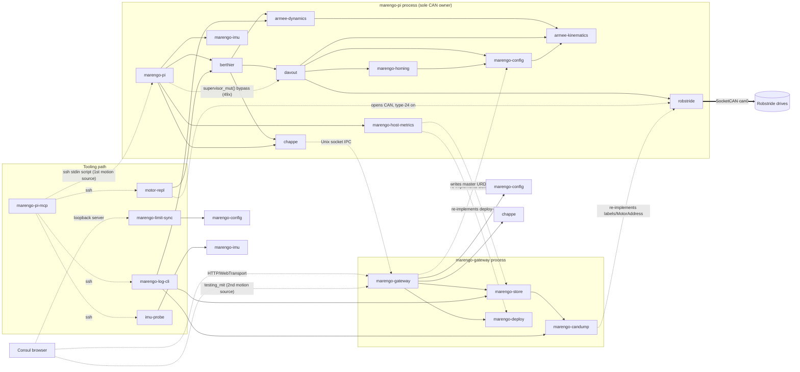

# Intent map (crate audit, baseline a2b55b3)

One row per workspace crate and bin, condensed from `intent/<crate>.md` §2–§4 (cited per row). "Depth" follows the card's codebase-design verdict: **deep** = small interface hiding substantial behaviour; **shallow** = pass-through or wide surface; **scaffold** = no code.

Cross-references to the safety-invariant matrix (`safety-invariants.md`, row ids DV/RF/HM/BT/RS/PI/MR) and the contracts inventory (`contracts.md`, flag ids C/P/R/T) were added after both files appeared; they are cited inline where they confirm or extend a card.

## 1. Crates and bins

### Runtime path (motors)

| Crate | Intent (one line) | Owns | Must not | Consumers | Depth | Card |
|---|---|---|---|---|---|---|
| `robstride` | Motor-space Robstride CAN driver: wire encode/decode, bounded fair receive, input-validity guard | 29-bit IDs, MIT/lifecycle/param/identity codecs, `CanBus`/`MotorBus`, receive engine, SocketCAN backends, host-echo routing | Limits, enable decisions, sign/gearing, fault authority, YAML | davout (sole `MotorBus` caller); marengo-pi, motor-repl (construct `RuntimeBus`); marengo-candump (`comm`) | codecs deep; `MotorBus` wide/shallow (19 methods, ≈12 used) | intent/robstride.md §2-§4 |
| `davout` | Safety gateway and only path to robstride: checks MIT batches, owns fault authority, private current-reference authority and its physical acquisition | `Supervisor<B: MotorBus>`, admission/filter, comm watchdog, joint↔motor transform, `FaultAuthority`, type-24 pacing, Set Limits patch, reference transaction + SQLite journal, `SimulationBus` | τ_g/trajectories, CAN byte encoding, opening SocketCAN | berthier, marengo-pi (direct via `supervisor_mut()`), motor-repl | deep behind `send_mit_batch`/`drain_feedback`, but ≈90 `pub fn` (a third test-only/refusing); enable sequencing has no owning module | intent/davout.md §2-§4 |
| `berthier` | Joint-space outer control loop: τ_g + friction/damping/impedance composition, Position hold executor | `ControlLoop::tick`, mode transitions, bootstrap/MissingFeedback, PositionHold law, planner, fuses (AscentStall, HoldTracking), gain runtime, Wave, trace, `robot/state` publish | CAN/robstride, E-stop/watchdog/hard limits, joint↔motor transform, IK/multi-joint timing | marengo-pi, motor-repl (wave-demo declared, unused) | `tick` deep; `supervisor_mut()` escape hatch shallow | intent/berthier.md §2-§4 |
| `armee-dynamics` | Pure-Rust gravity holding torque τ_g(q) from URDF; plus offline inertial calibration fit | `DynamicsModel`/`UrdfGravityModel`, `PureGravityTorque`, `max_gravity_torque_over_range`, calibration math | CAN, safety policy, motor transform, Coriolis/mass matrix/FK frames | berthier, marengo-pi + motor-repl (saturation preflight), marengo-log-cli (gravity-fit) | `gravity_torques`, `fit_gravity_params` deep; trait is a 1-adapter hypothetical seam | intent/armee-dynamics.md §2-§4 |
| `armee-kinematics` | URDF fact reader, shared ADR 0009 limit envelope, ADR 0017 expand-only widening | URDF load, actuated joints, hard/soft bounds, envelope math, expand, asset fixtures | Control loop, τ_g, command filtering, FK/IK | davout, berthier, marengo-config, armee-dynamics, sim-harness, talleyrand (unused) | envelope deep and pure; URDF facts shallow; `fixtures` is test support in the prod API | intent/armee-kinematics.md §2-§4 |
| `marengo-config` | Typed master YAML set, declarative safety-policy admission, velocity-cap resolver, Set Limits write-behind, path resolution | Schemas + loaders, `validate_safety_config`, ADR 0010 resolver, limit-patch semantics, profile txn/CAS, URDF expand/merge, commissioning scope, journal path | Runtime enforcement, CAN, loops, live SoT, env redirect of local mirror | davout (incl. per-tick revalidation), berthier, robstride, gateway, marengo-pi, log-cli, motor-repl, limit-sync, candump, homing | validator and writer deep; 9 overlapping validator entry points; no seams | intent/marengo-config.md §2-§4 |
| `marengo-homing` | *Live:* `JointHomingState` vocabulary, Ready/Enable-target policy, OutOfLimits flag, history parse. *Vestigial:* ADR 0006 lifecycle, verifier, writer, Hall sensors | `select_enable_targets`, `robot_ready`, OutOfLimits storage, typed history load | Grant reference/Ready, env/resource selection, GPIO | davout only (marengo-pi declares it unused) | `select_enable_targets` deep; `HomingRegistry` wide/shallow (17 methods, 3 used) | intent/marengo-homing.md §2-§4 |
| `marengo-pi` | Single long-running owner of the motors: composes Berthier→Davout→robstride, reference queue, Chappe intake/telemetry, write-behind persistence | Process composition, stdin grammar + reference queue, Chappe command intake, shutdown order, `limit_persist` worker, overlay dispatch, IMU and host-metrics threads | Direct CAN outside Davout; grants from history; blocking the tick on SD I/O | Operators (stdin), MCP tools, gateway (IPC), systemd | mixed; `ReferenceDriver` is a real seam; 3.4k LOC of logic in a bin | intent/marengo-pi.md §2-§4 |
| `motor-repl` | *Was* a one-shot bench CLI through Davout; *now* only `disable`, `set-zero`, `gravity-preview` (and `status` smoke) can do anything | Arg parsing, one Davout call per run, ordinary vs physical owner choice | Motion outside Davout; co-owning CAN with marengo-pi (enforced only by MCP) | MCP (`pi_motor_disable`, `pi_motor_recover`, `pi_hold_off`, `pi_set_zero`, `pi_gravity_preview`, broken `pi_motor_enable`/`pi_jog`), harness | shallow pass-through; 0 % coverage | intent/motor-repl.md §2-§4 |
| `marengo-imu` | BNO085 SHTP/I2C driver producing normalized rotation quaternions (telemetry-grade) | SHTP framing, SH-2 commands, report parsing, Linux I2C backend | Motor control, Chappe publishing, estimation | marengo-pi (`sensors/imu/torso`), imu-probe | `Bno085` medium-deep; `I2cBus` real seam (Linux + Mock) | intent/marengo-imu.md §2-§4 |

### Transport, operator edge and wire contract

| Crate | Intent (one line) | Owns | Must not | Consumers | Depth | Card |
|---|---|---|---|---|---|---|
| `chappe` | Transport-only pub/sub of protobuf envelope bytes: in-process broadcast + one Unix-socket bridge Pi↔gateway; tracing→LogEvent | `Bus`, IPC framing/bounds, runtime outbox classes, command allowlist + freshness, listener lifecycle, tracing layer | Motor commands/control policy, URDF/config, raw CAN | marengo-pi, berthier (`robot/state`), gateway (jetson declares, unused) | `Bus`, `IpcFanout`, `IpcListener` deep; `Transport` hypothetical seam (0 callers); topic contract triplicated | intent/chappe.md §2-§4 |
| `armee-proto` | Rust half of the proto-first wire contract (`prost-build` over `proto/`) | Rust codegen of `marengo.v1`; `prost` re-export | Logic, hand-edited codegen, topic names | chappe, berthier, homing, host-metrics, gateway, marengo-pi (Consul via buf, not this crate) | pure codegen seam | intent/armee-proto.md §2-§4 |
| `marengo-gateway` | Operator edge Consul↔Pi: IPC snapshot cache and fan-out, command relay, access policy, Set Limits orchestration, URDF library, log API, restart/self-update | Access middleware, snapshot/fan-out, limit-patch ACK honesty, URDF staging/activation, log ingest, restart/deploy triggers | Commanding motors / bypassing Davout; writing live limit YAML; inferring permission from stale telemetry (ADR 0019, Proposed) | Consul, MCP (`/health`, snapshots, logs), scripts | shallow adapter over config/store/deploy/chappe; `access.rs`, `limit_patch.rs` deep; ≈4k LOC policy in a bin | intent/marengo-gateway.md §2-§4 |

### Records, diagnostics and tooling

| Crate | Intent (one line) | Owns | Must not | Consumers | Depth | Card |
|---|---|---|---|---|---|---|
| `marengo-store` | Pi's durable historical record: logs (FTS), bench sessions/blobs, settings; refuse to corrupt or reinterpret history | Schema v1→v3 + atomic migration, log query, session registry, hot→blob archive, retention, journal import, `LogRingBuffer` | Authorize motion; repair arbitrary corruption; be the limit SoT | gateway, marengo-log-cli | deep `Store`; ring buffer belongs to gateway | intent/marengo-store.md §2-§4 |
| `marengo-candump` | One parser for recorded candump captures (untrusted input): summaries, paging, optional Robstride labels | Line syntax, timestamp domain, input bounds, summary/top IDs, paging, `CanId`, text format, enrichment | Session/blob path lookup, SQLite/HTTP, public line parser, re-implementing the wire format (partly violated) | marengo-store, gateway, marengo-log-cli → Consul, MCP `pi_candump_summary` | deep (3 entry points over ≈1k LOC) | intent/marengo-candump.md §2-§4 |
| `marengo-log-cli` | Shell/MCP entrypoint to the log store (sessions, archive, purge, journal import), candump inspection, store recovery, gravity-fit | CLI dispatch, candump-without-DB, gravity-fit pipeline (≈1.2k LOC) | Schema/backup logic itself; applying URDF changes or touching the Pi | systemd maintenance timer, MCP motion/log tools, operators | store subcommands shallow; gravity-fit deep | intent/marengo-log-cli.md §2-§4 |
| `marengo-host-metrics` | Linux host sample → `HostMetrics` proto ("unknown, not healthy zero" since G18/G19) | `/proc` CPU parsing, mounts/df, CAN state, services/clock/throttle, build identity, Chappe health conversion | Sockets/publishing, control decisions, log-retention policy (overlaps), deploy-rev parsing (duplicates) | marengo-pi only | `sample` deep; `diagnostics::Sources` real seam (disks/CAN only) | intent/marengo-host-metrics.md §2-§4 |
| `marengo-deploy` | Pi self-update lifecycle and installed-version status for the Consul sidebar | `deploy-job.json` schema/reconcile, `.deploy-rev` parse, upstream SHA cache, `UpdateUiState`, sudo enqueue | HTTP routing, auth, safety gates (gateway), Consul UI behaviour (borderline) | gateway (9 symbols) | medium; `current_version_status` deep, rest shallow re-exports | intent/marengo-deploy.md §2-§4 |
| `marengo-support` | One `init_tracing()` fmt subscriber for non-Chappe bins | Global subscriber with `EnvFilter` | Subscriber for Chappe producers; logic beyond bootstrap | motor-repl, log-cli, imu-probe, jetson, probe, teleop, wave-demo (pi and gateway declare it unused) | shallow (1 fn) | intent/marengo-support.md §2-§4 |
| `marengo-limit-sync` | Workstation-only mirror of a Durable Set Limits into the local checkout | CLI args → `LimitPatch`, exit receipt | Writing the Pi/installed tree; deciding Durable gating; limit math | `tools/limit-sync-local/server.ts` (after Consul POST) | shallow (one call into marengo-config) | intent/marengo-limit-sync.md §2-§4 |
| `imu-probe` | Read-only BNO085 hardware check | CLI + bounded sampling loop | CAN/motors; SHTP protocol | MCP `pi_imu_probe`, `pi_health` | shallow adapter | intent/imu-probe.md §2-§4 |
| `sim-harness` | Rust half of the ADR 0003 D1 sim tier: URDF↔MJCF DOF-count checks; reserved home for in-process bindings | 4 DOF-count tests, MJCF path helpers | Hardware in default tests; heavy sim deps outside features | scripts/CI only (no crate dependents) | shallow (one-line helpers); value is in the tests | intent/sim-harness.md §2-§4 |

### Roadmap scaffolds and dead bins

| Crate | Intent (one line) | Owns | Must not | Consumers | Depth | Card |
|---|---|---|---|---|---|---|
| `talleyrand` | Future motion planner: labeled poses/primitives → IK → joint trajectories for Berthier (ADR 0007/0014) | nothing yet | CAN/MIT encode; bypassing Berthier/Davout | marengo-jetson (declared, unused) | scaffold (1 doc line) | intent/talleyrand.md §2-§4 |
| `fouche` | Future Jetson perception + intent client (ADR 0014); never control | nothing yet | CAN/motors/RT loops; joint targets; on-robot LLM by default | marengo-jetson (declared, unused) | scaffold (1 doc line) | intent/fouche.md §2-§4 |
| `marengo-jetson` | ADR-backed Jetson node bin (perception + intent, never control) | nothing yet | CAN, motors, davout, robstride, control loops | systemd unit (never installed), deploy-jetson.sh (TODO) | scaffold (6 lines) | intent/marengo-jetson.md §2-§4 |
| `teleop` | Roadmap M8 placeholder (leader/follower vs gamepad intent unresolved) | nothing | Opening CAN (must go through owner) | roadmap link | scaffold (8 lines) | intent/teleop.md §2-§4 |
| `wave-demo` | Superseded: wave now runs in-owner (`bede6d6`, `39e8a8a`) | nothing | Becoming a second CAN owner | none | scaffold (4 lines) | intent/wave-demo.md §2-§4 |
| `probe` | Abandoned: CAN probing, now served by candump MCP tools; its stated intent contradicts bins/AGENTS.md | nothing | Direct CAN from bins | none | scaffold (6 lines) | intent/probe.md §2-§4 |

## 2. Dependency and boundary diagram

Solid arrows are Cargo dependencies used in production code. Dotted arrows are process/IPC/HTTP boundaries. Red-labelled edges are the boundary violations listed in §3.

Scaffold crates (`talleyrand`, `fouche`, `marengo-jetson`, `teleop`, `wave-demo`, `probe`, `sim-harness`) have no production edges and are omitted. `marengo-support` is omitted (bootstrap only).

## 3. Boundary violations and duplicated ownership

### 3a. Boundary violations

| # | Violation | Evidence | Card |
|---|---|---|---|
| V1 | Bins reach through the Berthier facade into Davout: `supervisor_mut()` used 49× in marengo-pi and 18× in motor-repl (incl. `disable_all`, `enable_targets`, `request_enable`, `bus_mut`, `send_joint_command`) | berthier `loop.rs:758-760`; prior arch gap 4 | intent/berthier.md §3, §7 |
| V2 | Davout hand-decodes Robstride comm types (magic `2`, `17`, `21`, `id >> 24`) despite AGENTS.md:199 | `davout/src/simulation.rs:90`, `reference_transaction.rs:1260`, `reference_journal_event.rs:269-270`, `feedback_consumer.rs:646` | intent/robstride.md §3 |
| V3 | Davout does disk/env I/O and blocking on the control thread: commissioning scope + robot.yaml + `MARENGO_JOINT_SUBSET` at every Enable; identity admission ≤100 ms; `calibrate_joint_zero` sleeps | `davout/src/lib.rs:1438-1453`, `:1779-1827`, `:922-948` | intent/davout.md §3 |
| V4 | Logic in bins: marengo-pi (reference queue, persist worker, overlay, preflight), gateway (≈4k LOC policy), log-cli (≈1.2k LOC gravity-fit) | `bins/AGENTS.md` anti-pattern | intent/marengo-pi.md §3; intent/marengo-gateway.md §2-§3; intent/marengo-log-cli.md §3 |
| V5 | Gateway writes the master URDF itself (dual writer with the Pi persist worker, G09) and infers management permission from stale/missing telemetry (G06; ADR 0019 Proposed) | `bins/marengo-gateway/src/hardware.rs:328-356`; `restart.rs:47-60` | intent/marengo-gateway.md §3 |
| V6 | marengo-config validator runs on every Davout tick although its doc says "no realtime logic" | `davout/src/lib.rs:958-975`; `safety_validation.rs:3-4` | intent/marengo-config.md §2, §8 |
| V7 | Two motion command sources into one owner: MCP stdin script and Consul `robot/testing/mit_command_batch` (only `pi_enable_soak` isolates) | marengo-pi `main.rs:576-660,1112-1120` | audit-leads #1 (L-marengo-pi-01) |
| V8 | CAN co-ownership is enforced only by MCP callers: every motor-repl run opens SocketCAN and turns type-24 on | `davout/src/lib.rs:543-545`; MCP `homing-preflight.ts`/`can-owner.ts` | intent/motor-repl.md §3, §10 L2 |
| V9 | marengo-deploy encodes Consul presentation (`UpdateUiState`, operator message text) — borderline | `status.rs:10-20,115-117` | intent/marengo-deploy.md §3 |
| V10 | marengo-host-metrics owns log-retention numbers (hardcoded 5 GiB budget) that belong to the store | host-metrics `lib.rs:91,199-208` | intent/marengo-host-metrics.md §3 |
| V11 | marengo-candump re-implements part of the Robstride wire vocabulary | candump `scan.rs:472-487`, `robstride.rs:7-11,35-64` | intent/marengo-candump.md §3 |
| V12 | Durable gating of the local limit mirror lives only in the browser, not in limit-sync or its server | `consul persist-joint-limits.ts:126`; `server.ts:134-156` | intent/marengo-limit-sync.md §2 |
| V13 | marengo-pi uses `println!` in a Chappe producer (deliberate: stdout is the MCP reference contract) | `main.rs:266-289,767-1000` | intent/marengo-pi.md §3 |
| V14 | Placement conflict: `marengo-jetson` depends on `talleyrand` while ADR 0014 §11 puts IK on the Pi | `bins/marengo-jetson/Cargo.toml:21` | intent/talleyrand.md §2; intent/marengo-jetson.md §8 |
| — | Not violations (cards checked): Berthier publishing `robot/state` (drift vs AGENTS.md:61, Chappe stays policy-free); armee-dynamics loading the URDF file (drift vs codemap) | — | intent/chappe.md §3; intent/armee-dynamics.md §3 |

### 3b. Concepts owned twice (or more)

| # | Concept | Copies | Prune/lead | Card |
|---|---|---|---|---|
| D1 | `MotorAddress` | `robstride/src/bus.rs:89-107`; private copy `marengo-candump/src/robstride.rs:7-11` | P-marengo-candump-01 | intent/marengo-candump.md §3, §9 |
| D2 | Comm-type label table | `robstride::CommunicationType`; `marengo-candump/src/scan.rs:472-487`; Davout magic numbers (V2) | P-marengo-candump-03 | intent/marengo-candump.md §9; intent/robstride.md §3 |
| D3 | Duplicate-address validation of the motor catalog | `SocketCanRouter::open` (`bus.rs:1394-1407`); `marengo-config` `safety_validation.rs:78-104`; candump `robstride.rs:55-60` | P-marengo-candump-02 | intent/marengo-candump.md §9 |
| D4 | `.deploy-rev` parser | `marengo-deploy/src/rev.rs:10-58`; `marengo-host-metrics/src/lib.rs:36-42` (keeps the timestamp) | P-marengo-host-metrics-03 | intent/marengo-deploy.md §4, §9; intent/marengo-host-metrics.md §3 |
| D5 | Log disk usage, `dir_size`, 5 GiB budget | `marengo-store` `paths.rs:31`, `store.rs:655-662,865-878`; host-metrics `lib.rs:91,199-224` (same symlink bug, L-marengo-store-07) | P-marengo-host-metrics-04 | intent/marengo-host-metrics.md §3, §9; intent/marengo-store.md §8 |
| D6 | `preflight_gravity_saturation` | marengo-pi `main.rs:808-855`; motor-repl `main.rs:23-66` | P-marengo-pi-05 | intent/marengo-pi.md §9; intent/motor-repl.md §9 |
| D7 | Chappe topic contract (×3) | chappe `ipc.rs:277-285`, `ipc_outbox.rs:11-19,143-147`; gateway `state.rs:17-60` (13 topics, incl. `robot/testing/telemetry` nobody forwards); marengo-pi `main.rs:1123-1129`; gateway redefines `TOPIC_LOGS` (`state.rs:22`) | L-chappe-09 | intent/chappe.md §4, §10 11 |
| D8 | Audit-action topic + publisher in marengo-pi | `limit_persist.rs:53-64`; `overlay.rs:44,676-686` | P-marengo-pi-04 | intent/marengo-pi.md §9 |
| D9 | Tracing subscriber bootstrap | `marengo-support` `init_tracing`; `chappe::tracing_layer::init_subscriber(None, _)` | L-marengo-support-02 (keep crate) | intent/marengo-support.md §4 |
| D10 | Limit-margin defaults | `armee-kinematics` `LimitMarginConfig::default` (slack 0.005); `marengo-config` defaults (slack 0.03) | P-armee-kinematics-04, L-armee-kinematics-07 | intent/armee-kinematics.md §3, §10 K7 |
| D11 | Limb Ready aggregation and proto homing decode | `marengo-homing` `limb_ready`, `from_proto_homing_state`; Consul `commissioning.ts` (which also hardcodes `MASTER_LIMBS` because the gateway does not expose `robot.limbs`), TS decode | P-marengo-homing-04, -05 | intent/marengo-homing.md §4; contracts.md C06 |
| D12 | Homing state / "history" | marengo-homing registry lifecycle + YAML calibration record vs Davout `reference_authority` + ADR 0036 SQLite journal | D-3 | intent/marengo-homing.md §2; intent/davout.md §9 P9 |
| D13 | Velocity-cap resolver alias | `resolve_desired_joint_velocity_cap` vs `resolve_joint_velocity_cap` | P-marengo-config-01 | intent/marengo-config.md §4, §9 |
| D14 | Safety validation entry points | Davout re-calls validators already nested in `validate_safety_config` | P-marengo-config-09 | intent/marengo-config.md §4 |
| D15 | URDF string load | marengo-config temp-file round trip vs `armee_kinematics::load_urdf` | P-marengo-config-06 | intent/marengo-config.md §9 P6 |
| D16 | Candump/log result model (×3) | crate serde model; gateway `logs.rs:136-200` JSON with aliases; proto `CandumpFrame/Page/Summary` and the log-store messages, which have drifted from the JSON wire | P-gateway-11, P-armee-proto-02 | intent/marengo-candump.md §4, §7; contracts.md P01 |
| D17 | Bus publish / IPC fan-out | `chappe::Bus` + `set_ipc_fanout`; `Transport::publish` + `SharedBus` | P-chappe-01 (D-2) | intent/chappe.md §4 |
| D18 | Active-reporting sync API | `sync_active_reporting` alias of `tick_active_reporting_leases` | P-davout-06 | intent/davout.md §9 P6 |
| D19 | Motor lists inside Davout | public `motors` vs immutable `stop_motors` | L-davout-19 | intent/davout.md §4.1 tangle 5 |
| D20 | "Online" | `FREE_DRIVE_FEEDBACK_TTL` 5 s vs grant liveness 100 ms | L-davout-23 | intent/davout.md §10 L24 |
| D21 | Drive fault byte | `MitFeedback.fault` vs `status_flags` | P-robstride-11 | intent/robstride.md §9 |
| D22 | `deploy-job.json` writers (×3) | marengo-deploy; `pi-enqueue-self-update.sh` (Python); `pi-self-update.sh` (heredoc) | L-marengo-deploy-01 | intent/marengo-deploy.md §2 |
| D23 | Master URDF writers | gateway activation; Pi `limit_persist` via marengo-config; local mirror (shared fixed `.tmp` names) | L-marengo-config-02 (G09) | intent/marengo-config.md §10 L3 |
| D24 | arm_4dof MJCF path helpers | `armee-kinematics::fixtures`; `sim-harness` | P-armee-kinematics-01 | intent/sim-harness.md §9 |
| D25 | TLS fingerprint set | gateway `main.rs:222`; `webtransport.rs:36` | P-gateway-05 | intent/marengo-gateway.md §9 |
| D26 | `LogRingBuffer` | defined in marengo-store, only consumer gateway (and write-only there) | P-gateway-02 | intent/marengo-store.md §9 |
| D27 | Gain arm+seed sequences | berthier `loop.rs:475-481,660-667,739-745`; `wire_gains_now` vs `resolve_all` | P-berthier-12 | intent/berthier.md §9 P12 |
| D28 | Velocity "limits" (×5) | ADR 0010 resolver (joint > group > type) is the only cap; `robot.bench.max_joint_velocity_rad_s`, `motors[].bench.velocity_limit_rad_s` and URDF `limit.velocity` also exist and disagree with it (bench 2.0 vs group 2.5) | L-marengo-config-19, P-marengo-config-08 | contracts.md C04, C05 |
| D29 | `motor_type` per joint | `control.joints.*.motor_type` (Berthier) and `motors[].motor_type` (Davout), validated equal | P-marengo-config-11 | contracts.md C08 |
| D30 | `position_trajectory_accel_rad_s2` | Berthier planner accel and Davout envelope decel read the same key | L-marengo-config-18 | contracts.md C17 |
| D31 | Safety-cap display | Consul static cap tables (17/60/120 Nm, 44–50 rad/s) duplicate control.yaml with wrong values | L-consul-01 | contracts.md C26 |

## 4. Doc drift summary

Counts are rows in each card's §8. "Worst" is the item most likely to mislead an operator or a code change.

| Crate | §8 rows | Worst drift | Card |
|---|---|---|---|
| davout | 13 | `codemap.md:12-14` says Enable requires Ready; `enable_targets` goes Disabled→Active. docs/safety.md:174-176/206-207 overstate type-24 pacing and the post-SetZero quiet. ADR 0036 says identity waits 50 ms (code 100 ms) | intent/davout.md §8 |
| berthier | 15 | `docs/position-hold-control-review.md:63` and docs/safety.md assume `kd_mit = 0`; code sends kd near target. GravityComp "hard-zero" (ADR 0004) is config-driven | intent/berthier.md §8 |
| robstride | 12 | MCP `pi_motor_disable` calls Disable a fault clear; hardware ADR 0002 says loopback is vcan-only (now on every socket); ADR 0002 "rated limits" are MIT wire scales (RS03 ±50 vs manual ±20) | intent/robstride.md §8 |
| marengo-pi | 7 | `print_usage` calls `home` a "readiness check only" but it transitions to Ready; codemap claims an E-stop input that does not exist | intent/marengo-pi.md §8 |
| motor-repl | 6 | AGENTS/codemap/Cargo call it an interactive REPL with enable/jog/hold; enable/jog/home cannot succeed; docs/pi-commissioning.md workflow uses `home`/`gravity-on` | intent/motor-repl.md §8 |
| marengo-config | 12 | `profile_txn.rs:28` "atomic" (also rewrites robot/homing yaml; no fsync); `lib.rs:3-4` "no realtime logic" | intent/marengo-config.md §8 |
| marengo-homing | 12 | `CONTEXT.md:25`, `docs/safety.md:22,24`, `docs/homing.md:186-197` describe a calibration record/verifier that production never writes | intent/marengo-homing.md §8 |
| marengo-gateway | 10 | ADR 0012 §3 CAS "expected_revision" (Consul never sends one); CONTEXT.md:40 restore opens a *new* staged import (it reuses the id) | intent/marengo-gateway.md §8 |
| chappe | 12 | ADR 0008:63 says marengo-pi sets `MARENGO_CHAPPE_SOCKET` (only `/etc/marengo/env` does); `lib.rs:160` "last successful publish" | intent/chappe.md §8 |
| armee-kinematics | 13 | `expand.rs:50-51` "expand soft outward only" (code clamps inward); codemap API names that do not exist | intent/armee-kinematics.md §8 |
| armee-dynamics | 8 | `lib.rs:59-61` relies on the wrong-sign watchdog, disabled in config; "type-level" pure-gravity claim with a pub field | intent/armee-dynamics.md §8 |
| armee-proto | 10 | codemap message field lists are stale (JointState, SafetyState, Fault, …); says davout depends on it | intent/armee-proto.md §8 |
| marengo-store | 7 | codemap calls it a telemetry key-value store; ADR 0011 `MARENGO_LOG_ARCHIVE_DAYS` unused | intent/marengo-store.md §8 |
| marengo-candump | 6 | not in any crate table/codemap; `--timestamp delta` reads like can-utils `-t d`, which it rejects | intent/marengo-candump.md §8 |
| marengo-log-cli | 5 | bins docs say it queries archived sessions (no such command) | intent/marengo-log-cli.md §8 |
| marengo-host-metrics | 7 | stub doc "for tests" but it is what a non-Linux marengo-pi publishes as live; `pmic_temp_celsius` holds CPU temp | intent/marengo-host-metrics.md §8 |
| marengo-imu | 7 | codemap says it publishes; CS18 timestamp-vs-accuracy comment | intent/marengo-imu.md §8 |
| marengo-deploy | 6 | `job.rs:85` "fail closed for enqueue" (corrupt job does not block enqueue); no codemap | intent/marengo-deploy.md §8 |
| marengo-support | 6 | claims repo-root resolution and lint ownership | intent/marengo-support.md §8 |
| marengo-limit-sync | 3 | not in bins tables; "Invoked by Consul" | intent/marengo-limit-sync.md §8 |
| sim-harness | 7 | codemap promises a synthetic bus/MemoryBus loop that does not exist | intent/sim-harness.md §8 |
| imu-probe | 2 | codemap omits two CLI args | intent/imu-probe.md §8 |
| talleyrand | 5 | berthier README "consumes Talleyrand setpoints"; host placement conflict | intent/talleyrand.md §8 |
| fouche | 4 | README "ONNX policies … LLM tooling" in present tense, contradicts ADR 0014 | intent/fouche.md §8 |
| marengo-jetson | 3 | service unit for a binary that exits immediately | intent/marengo-jetson.md §8 |
| teleop, wave-demo, probe | 2 / 1 / 1 | codemaps describe functionality that does not exist; wave is raised-cosine (`position_wave.rs`), codemaps/comments say triangle or sine | intent/teleop.md, wave-demo.md, probe.md §8; intent/berthier.md §8 |

Cross-cutting drift that several cards report: `AGENTS.md:157-158` and `docs/rust-patterns.md:43-44` show `davout::filter(cmd)?` and `robstride::send(cmd)?`, which do not exist (intent/davout.md §8; intent/robstride.md §8). `bins/AGENTS.md`/`bins/codemap.md` list 9 bins; there are 10 (intent/marengo-pi.md §8; intent/marengo-limit-sync.md §8). `crates/AGENTS.md:3` says each `//!` declares allowed deps; several crates do not (intent/marengo-config.md §8; intent/marengo-homing.md §8).

The safety-invariant matrix scores 210 documented safety rules: 133 enforced+tested, 45 enforced-untested, 19 documented-unenforced, 13 contradicted (`safety-invariants.md` §5). Its doc-vs-code contradictions C1–C12 (`safety-invariants.md` §4) overlap the drift above: C1 GravityComp gains (berthier), C2/C3 danger zones (davout; L-davout-26), C4 motor-repl exit disable (L-motor-repl-10), C5/C6 envelope dq source and slack default (L-davout-36, L-armee-kinematics-07), C7 identity wait 50 vs 100 ms (davout), C8 reference failure latch classes (L-davout-40), C9 ADR 0006 with no supersession note (D-3), C10 reference error exits without cleanup (L-davout-27), C11 `stop_speed_command` refusal (L-davout-29), C12 G16 blocking.
