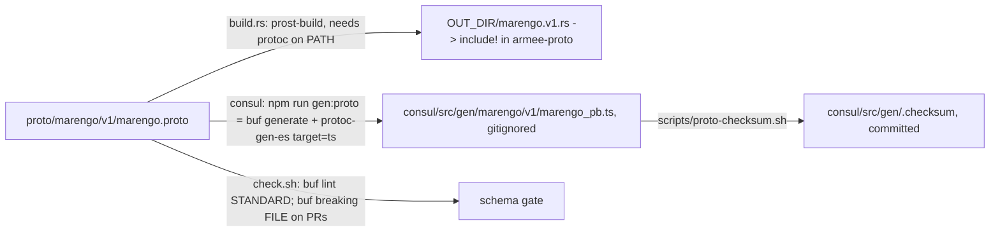

# Intent card: armee-proto

## 1. Header

| Field | Value |
|---|---|
| Crate | `armee-proto` |
| Path | `crates/armee-proto` (schema source: `proto/marengo/v1/marengo.proto`, 629 lines, 70 message/enum types) |
| Kind | lib + `build.rs` (no cargo features) |
| Baseline | `a2b55b3` |
| LOC src | `src/lib.rs` 143 (6 lines of code; lines 9-143 are inline round-trip tests); `build.rs` 23 |
| LOC tests | 0 integration; 7 inline unit tests |
| Sources | `src/lib.rs` `//!` 1-3; `build.rs`; `codemap.md`; `src/codemap.md`; `README.md`; `proto/README.md`; `proto/buf.yaml`; `consul/buf.gen.yaml`; `consul/package.json:11-13`; `scripts/check.sh:30-80`; `scripts/proto-checksum.sh`; AGENTS.md:68-70; crates/AGENTS.md:9; ADR 0001; ADR 0014 §6; repository-review.md:75; consul.md:9; `git log -- crates/armee-proto` (10 commits, first `61fe36d` 2026-05-19, last `9a7894e` 2026-08-09) and `-- proto` (latest `df46849` 2026-10-02); `cargo tree -i armee-proto`. |

## 2. Intent

armee-proto is the **Rust half of the proto-first wire contract**. `proto/` is the single language-agnostic schema for everything carried on **Chappe** (and gateway IPC/HTTP framing). This crate turns it into Rust types at compile time so Rust producers and consumers cannot drift from Consul's TypeScript (ADR 0001 Context/Decision; README.md:7-9; AGENTS.md:68-70). It is intentionally a thin `prost-build` wrapper with no logic. It owns neither topic names nor encoding policy (Chappe owns those), and generated code is never hand-edited (lib.rs:1-3; codemap.md:4,51). On the wire the payloads are binary protobuf, never JSON (ADR 0001 Decision bullet 4).

Generation pipeline vs Consul gen (two independent generators over the same schema):

- Rust: regenerated on every build; nothing is committed (build.rs:17-22; lib.rs:5).
- TS: generated by `buf generate --template buf.gen.yaml ../proto` (consul/package.json:11). The output is gitignored and pinned by a committed SHA-256 of `marengo_pb.ts` (scripts/proto-checksum.sh:2,13,26-33). It also runs as `predev`/`prebuild` (package.json:12-13).
- Schema gate: `buf lint` always and `buf breaking --against <base>/proto` on PRs (check.sh:36-70; proto/buf.yaml).
- No cross-language check exists beyond both generators reading the same file. [INFERENCE] That is sufficient for type shape; semantic drift (HTTP JSON aliases, ADR 0001 "Candump HTTP/proto evolution") lives outside both.

## 3. Owns / Must not

| Owns | Evidence |
|---|---|
| Rust codegen of `marengo.v1` | build.rs:17-22; lib.rs:5 |
| Re-export of `prost` for callers | lib.rs:7 |

| Must not | Evidence | Status |
|---|---|---|
| Control logic, files, hardware, runtime computation | codemap.md:51 | No violation (6 lines of code) |
| Hand-edited generated code | lib.rs:3; AGENTS.md:70 | No violation; nothing is committed |
| Workspace crate deps | codemap.md:49 | No violation (Cargo.toml:13-17) |

## 4. Interface

| Group | Items | Consumers (`cargo tree -i` + grep, file count) |
|---|---|---|
| Generated `marengo.v1` types (70 messages/enums) | e.g. `Envelope`, `RobotState`, `JointState`, `SafetyState`, `Fault`, `OperatorCommand`, `HostMetrics`, `MitCommandBatch` | chappe (5 files: `lib.rs`, `ipc.rs`, `tracing_layer.rs`, transport); berthier (2: `lib.rs`, `loop.rs`); marengo-homing (1); marengo-host-metrics (4); marengo-gateway (13 incl. `actuator.rs`, `limit_patch.rs`, `http.rs`, `webtransport.rs`, `framing.rs`); marengo-pi (13 incl. `main.rs`, `imu.rs`, `host_metrics.rs`, `limit_persist.rs`) |
| `prost` re-export | `armee_proto::prost::Message` | used across the consumers above. marengo-gateway also depends on `prost` directly (bins/marengo-gateway/Cargo.toml:29), a duplicate path to the same crate |
| Consul TS (parallel, not a Rust consumer) | `consul/src/gen/marengo/v1/marengo_pb.ts` | Consul via `@bufbuild/protobuf` (package.json:24) |

Depth: a pure codegen seam. The interface is the `.proto` file, and the Rust crate adds nothing. No traits or features.

Metrics (metrics/coverage-by-crate.md:9, coverage-by-file.md:119): 100% of `lib.rs` (110/110). These covered lines are the round-trip tests themselves, so the number says nothing about generated-code coverage. 7 tests (metrics/test-counts.md:11).

## 5. Invariants owned

| Invariant | Enforcing code | Test |
|---|---|---|
| Rust types match `proto/` at build time | build.rs:3-22 | build itself; round-trip tests (lib.rs:19-142) exercise prost rather than this crate |
| Wire enum values are stable (e.g. `JointHomingState` 0-4) | `.proto` numbering | `joint_homing_state_unspecified_is_zero` (lib.rs:60-66); `buf breaking` FILE on PRs (check.sh:45-70) |
| No incompatible schema change merges | `buf breaking` | CI PR-only (check.sh:46); untested locally (non-PR runs skip) |
| TS gen matches the committed checksum | scripts/proto-checksum.sh | check.sh:76-77 |

## 6. Inputs / outputs

- Input files: every `*.proto` under `../../proto` (recursive, build.rs:3-20). Include root `../../proto` (build.rs:18,21). Only `OUT_DIR/marengo.v1.rs` is included (lib.rs:5).
- Toolchain: `protoc` binary required (ADR 0001 Consequences; proto/README.md:12).
- Env: `OUT_DIR` (cargo). No config, CAN, HTTP or topics. Topic names live in Chappe and the bins (ADR 0014 §7 is the example).

## 7. Prior review reconciliation

| Prior id | Topic | Status | Evidence |
|---|---|---|---|
| repository-review.md:75 | Scope note: generated Rust, same proto also generates TS | **accurate** | build.rs; consul/buf.gen.yaml |
| consul.md:9 | Native Windows `gen:proto` passed | **unverifiable here** (macOS worktree; not re-run per scope) | n/a |

No CS/G/T/M finding targets armee-proto or proto codegen (grep of finding-index.md and ledger for `armee-proto`/`proto/`: none).

## 8. Drift

| Statement | Code reality |
|---|---|
| codemap.md:16 `JointState` fields `torque`, `temperature`, `motor_fault` | `effort`, `temperature_c`, `fault`, plus `name`, `homing_state`, `drive_active`, `out_of_limits` (marengo.proto:28-37) |
| codemap.md:15 `RobotState` has `control_mode`, `operational_mode` | Test constructs it with only `timestamp_ms`, `joints` (lib.rs:33-46) |
| codemap.md:18 `Fault` has `timestamp_ms` | Fields: `code`, `message`, `severity`, `joint` (marengo.proto:90-95) |
| codemap.md:20 `SafetyState` `estop_asserted, operational_mode, control_mode` | `timestamp_ms, mode, hardware_estop_asserted, software_estop_latched, active_faults` (marengo.proto:97-103) |
| codemap.md:22 `ImuSample` `accelerometer, gyroscope, temperature` | Quaternion/accel/gyro scalar fields + `has_*` flags (lib.rs:121-137) |
| codemap.md:23 `LogEvent` has `module_path, file, line` | Fields include `session_id`, `fields_json` (marengo.proto:200-206); [INFERENCE] remaining codemap fields absent, not re-verified line by line |
| codemap.md:44,50 "davout → OperationalMode, ControlMode"; "Depended upon by … davout, consul" | davout has **no** dependency on armee-proto (`cargo tree -i`); consul consumes `proto/` via buf, not this crate. Missing from the list: marengo-homing, marengo-host-metrics |
| codemap.md:13 "from `proto/marengo/v1/*.proto`" (plural) | One file, `marengo.proto` |
| ADR 0001 "CI: run `cargo build` and consul `gen:proto`" | Holds (check.sh:72-77), plus checksum and buf lint/breaking not mentioned in the ADR |
| ADR 0014 §6 proposes `CartesianPose`, `MotionPhase`, `NavigatorIntent`, `PerceptionFrame` | Not in the proto (grep: none). Consistent with ADR 0014 "Implementation order" (after the shelf) |

## 9. Prune candidates

| Candidate | Evidence class | Confidence | Deleting touches |
|---|---|---|---|
| Round-trip tests `heartbeat_roundtrip`, `robot_state_roundtrip`, `safety_state_roundtrip`, `enable_request_roundtrip`, `envelope_roundtrip`, `imu_sample_roundtrip` | Test pinning an implementation detail: they test prost's codec, not crate behaviour. Wire stability is enforced by `buf breaking` (check.sh:45-70) | med (keep `joint_homing_state_unspecified_is_zero`, which pins wire numbers locally) | lib.rs:19-58,68-142 |
| 13 proto types with **zero references** outside `proto/` and generated code (Rust crates/bins/tools; Consul TS excl. gen; scripts; docs except ADR 0013 naming `StructuredLogEntry`): `LogSessionMeta`(proto:408), `LogSessionList`(420), `StructuredLogEntry`(424), `StructuredLogList`(434), `CandumpTimestampMode`(453), `CandumpIdCount`(468), `CandumpInterfaceSummary`(473), `SessionStartRequest`(498), `SessionStartResponse`(503), `ModeChange`(564), `HoldCommand`(572), `PresetCommand`(577), `EnableChange`(581) | Zero references | low-med. Nested-only types can be live through a parent field (e.g. `CandumpPage.timestamp_mode` per ADR 0001 candump section) or through gateway HTTP JSON shapes; removal is a `buf breaking` event needing `reserved`. Defer the verdict to the contracts inventory | `proto/marengo/v1/marengo.proto`; regenerated TS checksum `consul/src/gen/.checksum` |
| Direct `prost` dep in marengo-gateway | Duplicate implementation (same crate is re-exported at lib.rs:7). `cargo machete` also flags it unused (metrics/unused-deps.md, marengo-gateway: `prost`) | med | bins/marengo-gateway/Cargo.toml:29 |

## 10. Phase-B leads

| # | Location | Why suspicious |
|---|---|---|
| P1 | build.rs:10 | `rerun-if-changed` is emitted per existing file only. Once any is emitted, Cargo stops watching the directory, so **adding a new `.proto` file** does not rerun build.rs until another watched file changes. Stale Rust types are possible while TS regenerates on every `predev` |
| P2 | build.rs:21 + lib.rs:5 | All protos under `proto/` are compiled, but only package `marengo.v1` is `include!`d. A future `marengo.v2` or second package compiles and is silently unreachable |
| P3 | scripts/proto-checksum.sh:15-23 | With no checksum file outside CI, it **writes** one and exits 0 (local self-blessing). CI fails only if missing. A local regen with a different `protoc-gen-es` version silently rewrites expectations when the file is deleted |
| P4 | check.sh:45-46 | `buf breaking` runs only for `pull_request` events in CI mode. Direct pushes to main and local `just check` never check breaking changes |
| P5 | consul/package.json:24,65 | Caret ranges (`^2.2.3`) on `@bufbuild/protobuf`/`protoc-gen-es`. The checksum depends on exact generator output; the lockfile pins it, but any lock refresh can flip the checksum unrelated to schema changes [INFERENCE] |
| P6 | marengo.proto (13 zero-ref types above) | Dead schema surface means unused oneof variants (`HoldCommand`, `PresetCommand`, `EnableChange`, `ModeChange`) in operator command types. Check whether gateway decode paths treat unknown/unused variants as fail-closed |
