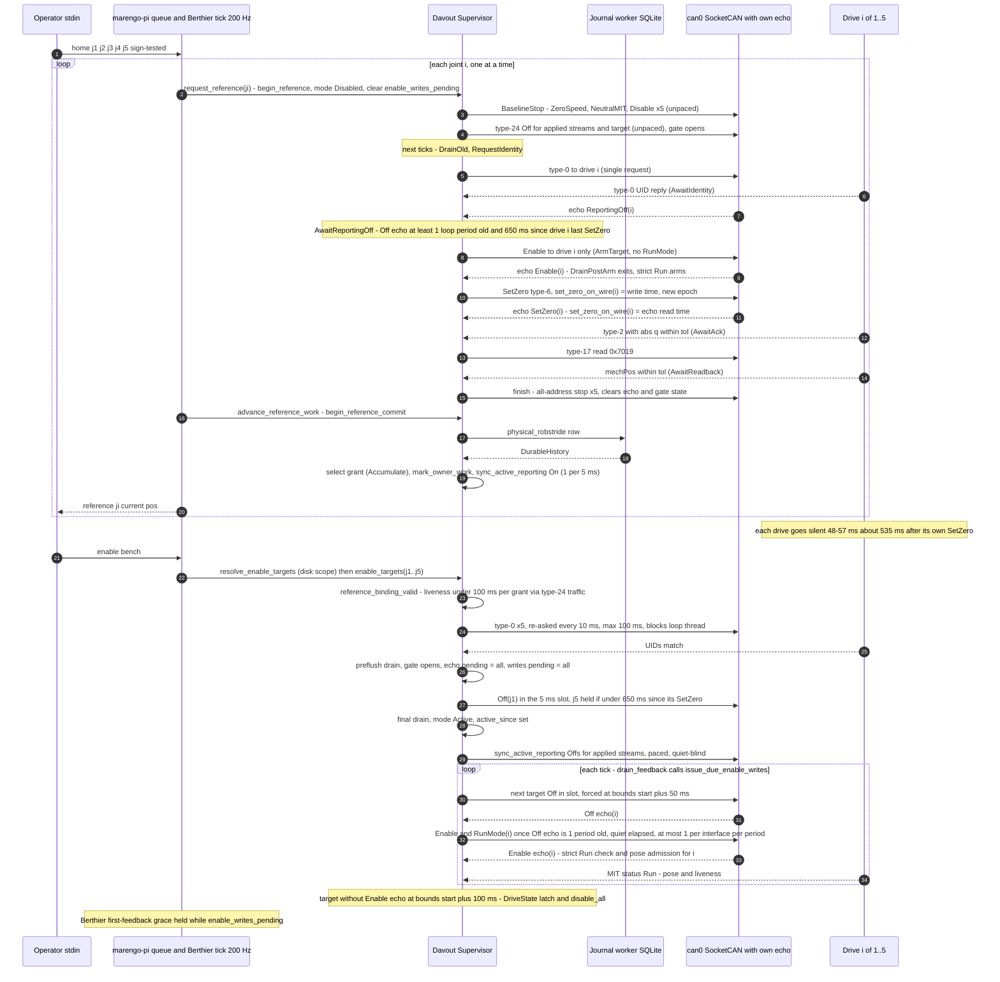

# Intent card: davout

## 1. Header

| Field | Value |
|---|---|
| Crate | `davout` ("Safety supervision for Marengo", `crates/davout/Cargo.toml:4`) |
| Path | `crates/davout` |
| Kind | lib (+1 example `examples/can_tick_bench.rs`, CPU bench from ef2b21b) |
| Baseline | a2b55b3 (audit/2026-10-03) |
| LOC | My split excluding in-file tests: production src ≈ 11.9 k, of which ≈ 1.17 k is simulation-only (`simulation.rs` 881, `simulation_reference.rs` 290). `lib.rs` is 3 088 production lines plus 1 862 test lines (`#[cfg(test)]` from :3089). In-src test files ≈ 5.5 k. `tests/` + `examples/` = 11 095. `metrics/loc.md` counts per file instead: 17 375 src / 10 800 test lines, 26/21 files |
| Tests | 120 per `metrics/test-counts.md:25`. 38 `#[test]` in `tests/physical_reference.rs` |
| Coverage | 89.1 % lines, 87.8 % regions, 86.8 % functions (`metrics/coverage-by-crate.md:22`). Per file in `metrics/coverage-by-file.md`, e.g. `feedback_consumer.rs` 82.6 %, `limit_envelope.rs` 84.5 %, `faults.rs` 99.5 % |
| Dependents | `berthier`, `marengo-pi`, `motor-repl` (`cargo tree -i davout --depth 1`) |
| Unused deps | none flagged for davout (`metrics/unused-deps.md`) |
| Sources consulted | AGENTS.md, crates/AGENTS.md, codemap.md, crates/davout/{codemap.md, src/codemap.md, README.md, src/lib.rs //!}, CONTEXT.md, docs/safety.md (§Known software gaps :150-237), docs/rust-patterns.md, docs/homing.md, ADR 0020/0021/0022/0023/0034/0035/0036, docs/reviews/2026-09-29/{finding-index.md, implementation-ledger.json, batch36, batch37}, `git log -- crates/davout` (76 commits, first 61fe36d 2026-05-19), commits e96798d 8123545 980926b edb8fb3 6a1bb9d 15542aa 169767a a2b55b3 |

## 2. Intent

Davout is the **safety gateway and the only path from controllers to `robstride`** (`lib.rs:1-5`, AGENTS.md:46, :51, crates/AGENTS.md:14). It turns joint-space **MIT command batches** from Berthier into checked motor-space frames: limits, caps, slew, danger zones, the wrong-sign watchdog and the per-address **communication watchdog**. It also owns the joint↔motor `direction`/`gear_ratio` transform in both directions (`lib.rs:12-13`, crates/AGENTS.md:44).

It owns persistent **fault authority**. A runtime hazard latches for the life of the process, triggers an all-address best-effort stop and is reported truthfully. Nothing recovers it (ADR 0020, `faults.rs:246-378`, docs/safety.md:155). It also owns private **current-reference authority**: no history, cache or public scalar can grant Ready, Enable or motion (ADR 0022/0023, `lib.rs:17-18`).

Since e96798d (2026-10-02, ADR 0036), Davout also *acquires* that reference physically. A one-joint transaction reads the drive's MCU UID, arms the target, sends SetZero and accepts only a type-2 ack plus a type-17 `mechPos` readback. A durable SQLite journal row must land before a per-joint grant is selected. The grant is then kept alive by UID, epoch and liveness checks (`lib.rs:21-39`).

The 2026-10-02/03 commits added an **enable and reference sequencing layer** that orders host writes against the wire. It reacts to SocketCAN write queuing, the mcp251x two-frame RX FIFO, type-24 streams that persist across processes, and a post-SetZero firmware blackout (§Enable and reference sequencing).

**Conflicting statements of intent:**

| Source A | Source B | Conflict |
|---|---|---|
| AGENTS.md:51 "Enable FSM, filter, watchdog, send" / must-not "Trajectories, URDF dynamics" | code | Davout now also owns a SQLite journal worker (`reference_journal.rs`, rusqlite dep `Cargo.toml:24`), byte-exact URDF/policy codecs (`reference_urdf_codec.rs`, `reference_codec.rs`) and disk reads of commissioning scope at Enable (`lib.rs:1438-1453`). AGENTS.md does not mention persistence. ADR 0034/0036 mandate it |
| codemap.md:12-14 FSM `Disabled→Ready→Active` (Ready via `set_homing_complete`) | `enable_targets` (`lib.rs:1361-1391`) | Scoped Enable goes Disabled→Active directly, without Ready. marengo-pi never calls `set_homing_complete` on enable (`bins/marengo-pi/src/main.rs:344`) |
| README.md:9 "joint limits, rate limits, fault reactions" | code | README omits reference acquisition, which is now ≈ 45 % of production LOC |

## 3. Owns / Must not

**Owns (cited):**
- Sole motor-command path: `Supervisor<B: MotorBus>` (`lib.rs:360-424`). Every TX goes through `self.bus` and no mutable transport is exported (`lib.rs:1287-1290`, `simulation.rs:878`).
- Joint↔motor transform: `motor_position_scale`, `joint_to_motor_command`, `motor_to_joint_state` (`lib.rs:2959-2986`, :2883-2904).
- Command admission/filtering (`lib.rs:2097-2236`, :2573-2741).
- Feedback consumption, hazard inspection, pose cache (`feedback_consumer.rs`).
- Fault authority and stop reporting (`faults.rs`, `lib.rs:2315-2421`).
- Type-24 Active Reporting desired/applied state, leases and pacing (`active_reporting.rs`).
- Live Set Limits patch/restore (`limit_envelope.rs`, ADR 0017, CONTEXT.md:48).
- Reference authority, physical/virtual acquisition, journal and commit (`reference*.rs`).
- Closed simulation transport (`simulation.rs`, ADR 0031).

**Must not (AGENTS.md:51, `lib.rs:44-48`, codemap.md:131):** compute τ_g/trajectories, encode CAN bytes, open SocketCAN.
- No violation found for CAN encoding or SocketCAN: Davout calls `MotorBus` methods only (e.g. `lib.rs:1712-1713`, :2352-2380).
- **Soft violation: config/disk I/O at runtime.** `resolve_enable_targets` reads `robot.yaml`, the persisted commissioning scope and `MARENGO_JOINT_SUBSET` on every Enable (`lib.rs:1442-1451`). The target set therefore comes from disk, not from the installed model.
- **Soft violation: blocking in the caller's thread.** `verify_physical_identities` (`lib.rs:1779-1827`) blocks up to 100 ms, and `calibrate_joint_zero` sleeps in a loop up to `search_timeout_s`+10 s (`lib.rs:922-948`).

## 4. Interface

### 4.1 Module responsibility map and tangles

| Module (prod LOC) | Responsibility | Coverage (lines) |
|---|---|---|
| `lib.rs` (3 088) | Enable FSM; admission/filter; comm watchdog; stop; enable **sequencing state** (8 fields `lib.rs:386-410`) and its gates (`:1541-1748`); physical identity admission (`:1756-1828`); grant liveness evaluation (`:958-1030`); commissioning facets and target resolution (`:1397-1453`); legacy/speed/refusal APIs; limit build (`:2988-3070`) | 89.0 % |
| `feedback_consumer.rs` (879) | Ordered merge of motor/Error/terminal/**host echo** events (`:261-330`); strict Run check (`:175-196`, :435-456); pose candidates; velocity trip (`:707-819`); physical `observe_position` (`:577-583`); Calibration-mode epoch bump (`:414-419`) | 82.6 % |
| `faults.rs` (382) | `FaultAuthority`, `SafetySnapshot`, `StopReport` | 99.5 % |
| `active_reporting.rs` (419) | type-24 leases, desired/applied, heartbeat, per-interface 5 ms slot, `off_written_at` (now a sequencing input) | 89.0 % |
| `limit_envelope.rs` (122) | `apply_limit_patch`, `restore_limit_snapshot` | 84.5 % |
| `reference.rs` (405) | `ReferenceAuthority`: grants, `Cell` revocation, `SelectionScope::{Replace, Accumulate}` | 96.1 % |
| `reference_transaction.rs` (1 754) | acquisition FSM for both backends in one `advance_reference` (`:891-1307`), terminals, stage continuity | 88.9 % |
| `reference_physical.rs` (299) | UID, epoch, continuity, liveness, reply inboxes | 97.1 % |
| `reference_commit.rs` (619) | commit owner; workflow API `request_reference`/`advance_reference_work`/`reference_outcome` | 93.3 % |
| `reference_journal.rs` (≈1 078), `reference_journal_event.rs` (392), `reference_codec.rs` (663), `reference_urdf_codec.rs` (506), `reference_model.rs` (134) | durable SQLite history, typed policy/URDF codecs, installed-model identity | 72.7–97 % |
| `simulation.rs` (881), `simulation_reference.rs` (290) | `SimulationBus`, virtual backend, sim constructors | 89.2 / 97.3 % |

**Tangles:**
1. **Enable sequencing has no owning module.** The state lives in `Supervisor` fields (`lib.rs:386-410`). It is mutated from `lib.rs` (enable `:1501-1504`, waves `:1549-1572`, stop clears `:2391-2396`), `feedback_consumer.rs` (echo handling `:305-317`), `reference_transaction.rs` (`begin_reference` clears `:863-864`, BaselineStop gate `:954-957`, ArmTarget pending `:1041-1043`, SetZero note `:1058-1060`) and `active_reporting.rs` (`off_written_at` `:144-152`). Liveness (`reference_physical.rs:277-294`) reads it through `withheld_since` (`lib.rs:1005-1008`).
2. **Reference concerns sit inside feedback.** Physical continuity and epoch updates happen in the pose loop (`feedback_consumer.rs:414-419`, :577-583). Identity and readback inboxes are fed from `consume_report_in_context` (`:238-245`).
3. **Both backends share one `advance_reference` match** with `backend.is_physical()` / `echoes_transmissions()` branches (`reference_transaction.rs:954`, :1018, :1082, :1188-1191, :1219). Virtual is simulation-only.
4. **`&self` getters have side effects.** `joint_homing_state`, `reference_generation` and `reference_snapshot` revoke through `Cell` (`lib.rs:646-649`, `reference.rs:103-104,150`).
5. **Two motor lists.** Stop, receive and echo bounds use the immutable `stop_motors` (`lib.rs:378`, :1931). Admission, watchdog and the Off/Enable gates use the public `motors` (`lib.rs:1593-1600`, :1675-1682, :1992, :2012).

### 4.2 Public surface by concept → consumers

| Group | Items | Production consumers | Test-only / none |
|---|---|---|---|
| Construction | `from_repo` (`lib.rs:431`), `from_repo_with_calibration_record_path` (:440), `from_repo_with_physical_reference` (:460), `…_and_record_path` (:470) | berthier `loop.rs` → marengo-pi/motor-repl (physical: `bins/marengo-pi/src/main.rs`, `bins/motor-repl/src/main.rs`) | `…_and_record_path`: zero-use (`metrics/pub-usage.md:43`) |
| Sim construction | `from_simulation*` (6 ctors `simulation.rs:686-819`), `bus_mut` (:878), `InitialVirtualReference`, `ReferenceReplyRule`, `ReferenceProofMode` | none (tests in berthier, marengo-pi) | `inspect_reference_journal`, `drain_raw` (`metrics/pub-usage.md:41,45`) |
| Enable FSM | `request_enable` (:1317), `enable_targets` (:1361), `resolve_enable_targets` (:1438), `set_homing_complete` (:851), `disable_all` (:2315), `enable_writes_pending` (:1746), `mode`, `active_joints`, `enable_session_started_at` | marengo-pi main.rs:344-351, 864, 888-889; berthier loop.rs:717-719, 1132 | `request_enable(true)`: only motor-repl paths that cannot hold reference (§9) |
| MIT output | `send_mit_batch` (:2083), `send_mit_joint` (:2074), `seed_tau_ff_rate_limiter`, `set_control_mode`/`control_mode` | berthier loop.rs:1384, 1420 | `filter_mit_command`, `filter_command` (no ext) |
| Legacy/speed | `send_joint_command`, `send_speed_command`, `stop_speed_command`, `filter_speed_command`, `JointCommand`, `SpeedCommand` | motor-repl main.rs:325, 357, 377 (unreachable, §9) | — |
| Feedback | `drain_feedback`, `refresh_feedback`, `begin_tick_feedback`, `joint_feedback`, `joint_position_rad`, `last_refresh_frame_count` | berthier loop.rs:1097-1098, marengo-pi | `refresh_feedback` (no ext), `joint_velocity_rad` (zero, `pub-usage.md:20`), `joint_torque_rad`, `clear_motor_states` (`pub-usage.md:40`) |
| Fault authority | `safety_snapshot`, `has_latched_fault`, `stop_generation`, `check_fault_authority`, `latch_control_fault`, `set_hardware_estop` | berthier loop.rs:1038-1056, 1450; marengo-pi | `set_hardware_estop`: tests only (GPIO not wired, `lib.rs:1293-1294`) |
| Reporting | `tick_active_reporting_leases`, `acquire/renew/release_active_reporting_lease`, `solicit_status_feedback` | marengo-pi main.rs:473, 1427 | `sync_active_reporting` (alias, `lib.rs:2488-2490`), `active_reporting_applied`, `ActiveReportingState::clear_applied{,_joint}` (`pub-usage.md:18-19`) |
| Facets/limits | `joint_commissioning_wire`, `joint_limit_policy`, `joint_velocity_cap`, `joint_position_progress_threshold`, `joint_drive_active`, `apply_limit_patch`, `restore_limit_snapshot`, `urdf_robot`, `validate_control_candidate`, `rebuild_limits` | marengo-pi overlay.rs, berthier loop.rs | `rebuild_limits`, `homing_registry`, `commissioning_facets`, `joint_out_of_limits` (no ext) |
| Reference workflow | `request_reference`, `advance_reference_work`, `reference_work_pending`, `reference_outcome`, `reference_busy`, `cancel_reference_for_shutdown`, `close_reference_journal_admission`, `drain_reference_journal_until`, `calibrate_joint_zero` | marengo-pi reference_queue.rs:33-40, main.rs; berthier loop.rs:1066-1069; motor-repl main.rs:393 | — |
| Reference low-level | `begin_reference`, `advance_reference`, `cancel_reference`, `reference_snapshot`, `begin/advance/cancel_reference_commit`, `reference_commit_snapshot`, `reference_generation` | none in production | berthier and marengo-pi tests only |
| Refusal stubs | `set_zero_position` (:2306), `verify_zero_after_set` (:870), `request_enable_for_calibration` (:1341) | none | `pub-usage.md:46,49` |
| Consts | `POST_SET_ZERO_QUIET` (:146), `FREE_DRIVE_FEEDBACK_TTL` (:133), `DEFAULT_LEASE_TTL` | berthier loop.rs (TTL), marengo-pi (lease) | `POST_SET_ZERO_QUIET`: no ext |
| Re-exports | `MotorBus`, `MemoryBus`, `BusError`, `MotorAddress`, `JointHomingState`, `JointLimitPolicy` (`lib.rs:75`, :291-292) | berthier, marengo-pi tests | — |
| Feature | `reference-journal-test-support` (`Cargo.toml:14`): pause hooks in journal/simulation (`reference_journal.rs:183…942`, `simulation.rs:26,698-783`) | enabled only through dev-deps (`crates/berthier/Cargo.toml:28`, `bins/marengo-pi/Cargo.toml:41`) | never in a production build (resolver 2) |

**Depth (codebase-design):**
- `Supervisor` is deep behind `send_mit_batch`/`drain_feedback`, which hide ≈ 1 k lines of admission and receive policy. Its interface is very wide, though: ≈ 90 `pub fn`, about a third test-only or refusing.
- **Seams.** `MotorBus` is a real seam with ≥ 5 adapters: robstride SocketCAN/Routed (prod), `MemoryBus`, `SimulationBus`, test `FirmwareBus` (`tests/physical_firmware/mod.rs:445`) and the example bench bus (`examples/can_tick_bench.rs:134`).
- `ReferenceBackend` is a closed enum, not a trait (`reference_transaction.rs:251-254`). Its `Virtual` arm is a function-pointer table with one adapter (`simulation_reference.rs:274`), a hypothetical seam that exists only for simulation.
- The commit selection modes `HistoryOnly`/`CurrentVirtual`/`CurrentPhysical` (`reference_commit.rs:136-141`) have one production value: `CurrentPhysical` (`lib.rs:519`).

### 4.3 Publicly mutable config fields

`pub motors`, `pub control`, `pub homing_config` (`lib.rs:370-372`).

- **Only production writer:** marengo-pi overlay `loop_ctrl.supervisor_mut().control = draft` (`bins/marengo-pi/src/overlay.rs:365`), after `validate_control_candidate`.
- **Test writers:** tests mutate all three to prove revocation (`tests/current_reference.rs:237-307`, :327, :358, :543-561, :616; `tests/torque_output_contract.rs:18,106,131`).

Consequences (the per-tick revalidation tax):
1. `reference_binding_valid` runs the full `validate_safety_config(robot, motors, control, homing)` on every call (`lib.rs:965-975`). It is called from every `poll_feedback` (`lib.rs:1866-1874`), which runs twice per tick (berthier loop.rs:1098, :1386); from every send via `ensure_reference_for_active` (`lib.rs:2121`); and from each `joint_homing_state` (`lib.rs:646-657`). `commissioning_facets` triggers it up to 3× per joint (`lib.rs:1412-1426`). Perf commit 0a75a1c removed clones but not this.
2. `ReferenceAuthority::validate_binding` re-compares motor, control and homing reference fields every call (`reference.rs:321-336`).
3. The routing cache is revalidated per lookup (`address_for` `lib.rs:815-820`) and per batch (`sync_motor_addresses` `lib.rs:2122`).
4. Every `advance_reference` builds a `serde_json` policy snapshot and compares it (`reference_transaction.rs:918-920`, :1451).
5. A second, immutable copy (`stop_motors`) must exist so stops cannot be redirected (`lib.rs:377-378`). That produces tangle 5.
6. Danger-zone and validation branches exist that validation already makes unreachable (§9 P7).
7. codemap.md:76 lists "Fully immutable coordinated policy/model installation remains CS15 work". Making the fields private, with one `install_control_overlay`, would remove items 1–6 [INFERENCE].

### 4.4 Simulation-only vs production paths

| Path | Class | Evidence |
|---|---|---|
| `ReferenceBackend::Virtual`, `VirtualBackend`, `ReferenceAuthority::initial_virtual`, `SelectionScope::Replace`, `CommitSelection::{HistoryOnly, CurrentVirtual}`, `AwaitEvidence` phase | simulation-only | constructed only in `simulation.rs:697-867`, `simulation_reference.rs:274` |
| Non-echo Enable branch (all Enables written before activation) | effectively simulation/MemoryBus-only | `lib.rs:1505-1511`. `MotorBus::echoes_transmissions` defaults to false (`robstride/src/bus.rs:281-283`), and the Pi's SocketCAN/Routed buses return true (`bus.rs:1374-1376`, :1518-1521) |
| Echo-bus gates R1–R10 (§Enable and reference sequencing) | production-only in practice | exercised only by the emulator in `tests/physical_reference.rs` and the bench, never by `SimulationBus` |
| `inspect_reference_journal`, `drain_raw`, `bus_mut`/`SimulationAccess` | test-only | `simulation.rs:494-605`, :794 |
| `reference-journal-test-support` hooks | test builds only | §4.2 |

## 5. Invariants owned

| # | Invariant | Enforcing code | Tests that fail if broken | File cov. |
|---|---|---|---|---|
| I1 | No motion frame without current private reference for every addressed joint | `ensure_reference_for_active` `lib.rs:1039-1046`, :2121; `require_reference_permission` :1067-1079 | `tests/current_reference.rs` (`stale_reference_cannot_pass_active_shortcuts_or_output`, `direct_scoped_enable_on_fresh_unhomed_refuses_before_arming`) | lib 89.0 |
| I2 | Batch admission is atomic: a rejected batch emits nothing and leaves limiter state unchanged | `admit_and_send_mit_with` `lib.rs:2108-2188` | `command_admission.rs::rejected_batch_emits_nothing_and_does_not_advance_output_history` | 89.0 |
| I3 | Finite, non-negative commands and an f32-safe wire | `validate_mit_command` :2852, `checked_wire_float` :2871 | `command_admission.rs::all_nonfinite_mit_fields_and_negative_gains_are_rejected_before_clamping`, `invalid_motor_transform_is_rejected_before_any_batch_frame` | 89.0 |
| I4 | kp/kd ≤ type max. Position clamped to envelope ∩ hard. Velocity ≤ cap | `filter_mit_core` :2599-2662 | `lib.rs` tests `rejects_velocity_outside_limits`, `filter_command_clamps_position_into_envelope` | 89.0 |
| I5 | tau_ff ≤ min(policy, bench, type, danger) after slew. First enable slews from 0. ≤ 10 ms of slew credit per tick | `rate_limit_tau_ff` :2924-2943, :2663-2674, clears :1524, :2402 | `torque_output_contract.rs` (5 tests) | 89.0 |
| I6 | Every active address needs a pose newer than activation and within `comm_watchdog_ms`. Only neutral MIT is allowed during bootstrap | `check_comm_watchdog` :1980-2052, `pose_is_current` :1967-1978 | `command_admission.rs::one_live_peer_cannot_mask_a_silent_active_motor`, `nonneutral_motion_requires_post_enable_feedback_even_during_bootstrap`; `lib.rs::watchdog_fires_when_active_without_first_feedback` | 89.0 |
| I7 | First hazard latches, stops all addresses once, and is never cleared | `FaultAuthority::record` `faults.rs:296-329`; `record_runtime_error` `lib.rs:1179-1225` | `fault_authority.rs` (17), `fault_snapshot.rs` (10) | 99.5 |
| I8 | Stop attempts every installed address (3 actions) and reports failed writes. A failed write revokes reference and latches StopDelivery | `perform_stop` :2341-2421 | `fault_authority.rs::hardware_input_assertion_attempts_disable_for_every_configured_motor`, `physical_reference.rs::terminal_stop_failure_refuses_storage_and_grant` | 89.0 |
| I9 | Pre- and post-enable flush must be complete or Enable rolls back | `lib.rs:1461-1463`, :1512-1516 | `receive_bounds.rs::incomplete_pre_enable_flush_refuses_activation`, `incomplete_post_enable_flush_rolls_back_before_session_marker` | 89.0 |
| I10 | Strict Run applies only after the address's own Enable echo. A missing echo latches DriveState | `feedback_consumer.rs:175-196`, :305-309, :497-504; `enable_echo_overdue` `lib.rs:1925-1965` | `physical_reference.rs::reset_report_on_the_wire_before_enable_is_not_post_enable_evidence`, `reset_report_after_the_enable_echo_still_faults`, `missing_enable_echo_fails_closed_within_watchdog`, `stale_enable_echo_cannot_arm_a_target_not_yet_written` | fc 82.6 |
| I11 | On echo buses, no Enable before that target's type-24 Off echo is ≥ 1 loop period old | `reporting_off_settled` :1592-1609, `take_enable_wave` :1549-1572; reference `AwaitReportingOff` `reference_transaction.rs:1245-1254` | `physical_reference.rs::stream_left_on_by_an_earlier_process_is_off_before_each_target_enable`, `inherited_stream_is_off_before_each_staggered_enable`, `missing_reporting_off_echo_withholds_enable_and_fails_closed`, `missing_reporting_off_echo_refuses_reference_before_enable` | 89.0 |
| I12 | No gate Off or Enable to an address within 650 ms of its last SetZero | `set_zero_quiet_elapsed` :1642-1645 used at :1554, :1684, `reference_transaction.rs:1026-1031`, :1247-1248 | `physical_reference.rs::enable_right_after_the_last_reference_is_held_past_the_set_zero_blackout`, `reset_after_a_held_enable_reaches_the_wire_still_faults` | 89.0 |
| I13 | At most one Enable per interface per control period, with catch-up at `comm_watchdog_ms/2` | `take_enable_wave` :1549-1572, `enable_catch_up` :1662-1667 | `physical_reference.rs::staggered_enable_writes_one_target_per_interface_per_control_period`, `missing_echo_of_a_staggered_enable_fails_closed` | 89.0 |
| I14 | At most one type-24 write per interface per 5 ms (sync and gate Offs) | `active_reporting.rs:154-160`, :364-370, :130 | `active_reporting_pacing_tests.rs` (5) | 89.0 |
| I15 | Physical grant needs UID + post-SetZero type-2 ack + post-request `mechPos` within tolerance + durable journal row | `reference_transaction.rs:1201-1239`, :1255-1281, :1311-1398; `reference_commit.rs:402-424` | `physical_reference.rs` acquisition refusals (`missing_set_zero_ack_times_out_before_readback`, `readback_outside_tolerance_refuses`, `identity_answering_at_two_addresses_refuses_before_arming`, …) | rt 88.9 |
| I16 | A grant is revoked per joint on UID change or missing UID at Enable, discontinuity, Calibration mode, or silence > `comm_watchdog_ms` | `lib.rs:993-1027`, :1756-1828; `reference_physical.rs:137-159`, :222-294 | `physical_reference.rs::identity_mismatch_at_enable_revokes_without_enable`, `missing_identity_at_enable_revokes_without_enable`, `reboot_silence_beyond_watchdog_revokes_only_that_joint`, `coordinate_discontinuity_after_grant_revokes`, `identity_request_dropped_in_post_set_zero_blackout_is_asked_again` | 97.1 |
| I17 | A relevant policy mutation revokes permanently, even if restored | `reference_binding_valid` :958-1030 | `current_reference.rs::reference_policy_mutation_permanently_revokes_even_if_old_fields_are_restored` | 96.1 |
| I18 | Feedback velocity trips at limit + 0.5 rad/s, 3 trips (Active only) | `feedback_consumer.rs:721-819`, consts `lib.rs:325-328` | `lib.rs::active_feedback_velocity_above_limit_faults`, `stationary_feedback_velocity_spike_is_ignored` | 82.6 |
| I19 | Wrong-sign watchdog trips in GravityComp | `wrong_sign_step` :2682-2741 | 6 `wrong_sign_watchdog_*` tests in `lib.rs` | 89.0 |
| I20 | Hardware E-stop assertion latches and stops | `set_hardware_estop` :1292-1314 | `fault_snapshot.rs::newly_asserted_hardware_input_attempts_stop_even_after_an_existing_fault` | **gap:** never called in production (GPIO not wired, `lib.rs:1293`, docs/safety.md:152) |
| I21 | Set Limits refuses a patch that excludes the current measured position | `limit_envelope.rs:65-79` | `lib.rs::limit_patch_rejects_measured_position_outside_new_bounds` | **gap:** effectively dead (CS16, §10 L17) |
| I22 | Danger zone `clamp_torque` caps torque | `apply_danger_zone_clamps` :2765-2799 | `torque_output_contract_danger_zone_cap_overrides_previous_torque` | 89.0. There is **no test of `clamp_velocity` braking with kd=0** (CS14 open part) |

## Enable and reference sequencing

### Timing and ordering rules (added 2026-10-02/03 plus pre-existing anchors)

| ID | Rule | Commit | Firmware / hardware behaviour it answers | Code |
|---|---|---|---|---|
| R0 | Complete bounded drain before Enable writes and again before the session marker | d4c869b/6d5cedf (pre) | CAN status has no command generation | `lib.rs:1461-1463`, :1512-1516 |
| R1 | "Post-enable" starts at the address's own **Enable echo**, not at the write. Frames popped earlier are inspected for hazards but are neither held to Run nor admitted as pose | edb8fb3 | A SocketCAN write only queues. A Reset report can be on the wire before the queued Enable yet be read after activation (bench, roll) | `feedback_consumer.rs:175-196`, :305-309, :497-504 |
| R2 | A missing Enable echo latches DriveState once `comm_watchdog_ms` has passed since the bound start | edb8fb3 | Without the echo the strict Run check never arms | `lib.rs:1925-1965` |
| R3 | Reference `DrainPostArm` waits for the target's Enable echo under an unrenewed 2 s phase deadline | edb8fb3 | Same as R1, on the reference path | `reference_transaction.rs:1192-1200`, :1298-1305, :24 |
| R4 | **Enable stagger:** Enable+RunMode for ≤ 1 target per interface per control period (`loop_hz`). Remainder forced at `comm_watchdog_ms/2` | 6a1bb9d | mcp251x keeps 2 RX frames. Every host frame solicits a reply. 70 frames in 12.2 ms overran can0 (6a1bb9d message, safety.md:165-176) | `lib.rs:1549-1572`, :1662-1667, :1724-1741 |
| R5 | Every target is echo-pending from activation. An Enable echo for a target still in `enable_writes_pending` is ignored | 6a1bb9d | An older echo must not arm a target not yet written | `lib.rs:1502-1503`, `feedback_consumer.rs:305-309` |
| R6 | **type-24 pacing:** `sync` and `write_off` take one slot per interface per 5 ms. Healthy refreshes rotate | 6a1bb9d, 0a3fc6b (batch37) | Five type-24 Ons at startup overran can0 | `active_reporting.rs:21-27`, :123-140, :294-391 |
| R7 | Berthier keeps its first-feedback grace open while `enable_writes_pending()` | 6a1bb9d | Unwritten targets cannot have pose | `berthier/src/loop.rs:1129-1137`, `lib.rs:1746-1748` |
| R8 | **Off before every Enable:** each target's Off is written whatever this process applied. Enable only once that Off's echo (since the gate opened) is ≥ 1 loop period old | 15542aa | Drives keep type-24 across host processes. A report built before the drive acts on Enable can be read after the Enable echo, still in Reset (14:55:24 right_lower_arm_yaw) | `lib.rs:1575-1623`, :1673-1697; reference `BaselineStop` `reference_transaction.rs:946-964`, `AwaitReportingOff` :1245-1254, `ArmTarget` re-check :1018-1031 |
| R9 | A missing Off echo latches DriveState at the R2 bound with the message "type-24 Off not observed" | 15542aa | Fail closed instead of withholding Enable forever | `lib.rs:1944-1952` |
| R10 | Grant liveness for an echo-pending Active target counts from the bound start (`withheld_since`) | 15542aa | Davout ignores the target's traffic while pending, so silence must not revoke it | `lib.rs:1005-1015`, `reference_physical.rs:271-294` |
| R11 | **Identity admission retry:** type-0 to every target before any Enable, re-asked every 10 ms, ≤ 100 ms from the first request. Only replies popped after the watermark count | 169767a (retry), e96798d (check) | A drive drops type-0 received in its post-SetZero blackout (15:34 gravity calibration) | `lib.rs:1756-1828`, `reference_physical.rs:17-29` |
| R12 | **Post-SetZero quiet:** no gate Off and no Enable to an address within `POST_SET_ZERO_QUIET` = 650 ms of its latest SetZero. The SetZero time is the write time, superseded by the echo read time | a2b55b3 | ≈ 535 ms after SetZero each drive is silent 48–57 ms and ignores frames. An Enable there leaves it in Reset → DriveState | `lib.rs:135-146`, :1488-1500, :1554, :1627-1645, :1684; `feedback_consumer.rs:315-317`; `reference_transaction.rs:1058-1060`, :1219-1237, :1247-1248, :1026-1031 |
| R13 | `enable_bounds_start = max(active_since, quiet end)` re-anchors R2, R4 catch-up, R10, the neutral-bootstrap watchdog grace and the CommWatchdog non-latch window | a2b55b3 | A held Enable must not fail for being held | `lib.rs:1651-1657`, :1662-1667, :1938, :2027-2031, :1184-1193 |
| R14 | Reference ack must be a type-2 from the target, popped after the SetZero **write**, with \|q\| ≤ tol. Readback must be popped after its own request | e96798d | Type-24 reports are not acks. Write-time ordering only | `reference_transaction.rs:1255-1281`, :995-999, :1318-1328 |
| R15 | Reference phases: one phase per `advance`, 2 s per new phase capped by `search_timeout_s`, repeated waits not renewed | e96798d | Bounded acquisition | `reference_transaction.rs:1298-1305`, :1743-1752 |

### Overlaps and interactions (input for Phase-B consolidation)

1. **Four anchors, three clocks.** The anchors are `active_since`, `enable_bounds_start`, Off-echo read time + loop period, and `enable_write_due`. They are scaled by three sources:
   - `comm_watchdog_ms`, which drives R2, R9, R10, R13, the R4 catch-up (/2) and the bootstrap grace;
   - `loop_hz`, which drives the R4 stagger and the R8 settle (`lib.rs:1541-1543`);
   - fixed constants: 5 ms type-24 slot (`active_reporting.rs:27`, which assumes 200 Hz), 100/10/5 ms identity (`reference_physical.rs:24-29`), 650 ms quiet, 2 s phase.

   `IDENTITY_ADMISSION_TIMEOUT` = 100 ms only coincides with the default `comm_watchdog_ms: 100` (`config/control.yaml:5`). Its doc comment relies on that coincidence (`reference_physical.rs:22-23`).
2. **Two Off writers share one slot but not one rule.** The gate (`issue_target_reporting_offs`) checks the quiet (`lib.rs:1684`). `sync_active_reporting` in Active mode writes Offs for every applied stream without checking the quiet (`active_reporting.rs:357-391`, called at activation `lib.rs:1526` and every tick via `bins/marengo-pi/src/main.rs:1427`). Its Off satisfies `reporting_off_written` (`lib.rs:1581-1586`, :1683), so the gate never re-writes it. That contradicts docs/safety.md:206-207 "no gate Off … until POST_SET_ZERO_QUIET". See §10 L2.
3. **The same physical fact is handled in three places.** The post-SetZero blackout is handled by R11 (retry identity), R12 (hold Off/Enable) and R13 (re-anchor bounds). The reference path covers only the same address (AwaitReportingOff). `AwaitIdentity` sends one type-0 and never re-requests (`reference_transaction.rs:995-1015`, :1201-1206). A re-home of the same joint whose RequestIdentity lands in [535, 592] ms would time out after 2 s [INFERENCE].
4. **Pacing covers only part of the TX surface.** R4 and R6 pace Enables and `sync`. Bursts remain in `perform_stop` (3 × N frames, `lib.rs:2350-2388`), `suspend` (N Offs, `active_reporting.rs:102-116`), identity admission (N type-0 every 10 ms, `lib.rs:1817-1822`) and `solicit_status_feedback` (N Disables, `lib.rs:2453-2461`). Per 6a1bb9d's evidence the identity burst was part of the overrun. See §10 L1.
5. **Activation precedes enabling.** On echo buses `mode = Active` and `active_since` are set before any Enable is written (`lib.rs:1518-1521`). Enables are written later from `poll_feedback` → `issue_due_enable_writes` (`lib.rs:1876`). Rules R2, R7 and R10 exist partly to compensate for that ordering. A design that activates per address at echo time would merge R2/R5/R10/R13 into one per-address state [INFERENCE].
6. **R10 vs R2 vs liveness.** For a pending target, liveness is held open from the bound start, and R2 latches at bound + 100 ms. Both use the same window, so R2 always fires first or together with liveness. This is intentional (15542aa message).
7. **Disabled-state liveness depends on the type-24 stream.** After `home`, grants survive only if traffic arrives every ≤ 100 ms (`reference_physical.rs:277-294`). In Disabled mode that traffic exists only while `bench.active_reporting_diagnostics: true` (`config/control.yaml:11`) or a lease. The stream's own retry fires at 200 ms (`active_reporting.rs:31`), later than liveness. See §10 L3.
8. **The R8 settle check correlates by time, not identity** (`echoed >= written`, `lib.rs:1604-1608`). The R1 Enable echo correlates by "not still queued" (`feedback_consumer.rs:306`). Neither binds an echo to a specific write.
9. **The R12 SetZero record is shared by reference and Active.** `set_zero_on_wire` is never cleared (no `.clear()`, grep). It is bounded by address count and harmless after 650 ms.
10. **Reference Enable ≠ Active Enable.** `ArmTarget` writes Enable only (`reference_transaction.rs:1038`). Active writes Enable + RunMode::Mit (`lib.rs:1712-1713`).

### Sequence: 5-joint `home … sign-tested`, then `enable` (all five on can0, `config/motors.yaml:11-70`)

## 6. Inputs/outputs

- **Config (via `marengo_config`):**
  - `control.yaml`: `loop_hz`, `comm_watchdog_ms`, `feedback_poll_budget_us`, `feedback_drain_quiet_us`, `tau_ff_rate_limit_nm_per_s`, `motor_type_defaults{kp_max,kd_max,tau_ff_max_nm}`, `danger_zones`, `wrong_sign_watchdog`, `bench.{active_reporting_diagnostics, allow_firmware_speed_mode}`, per-joint margins.
  - `motors.yaml`: `joint, can_interface, device_id, motor_type, direction, gear_ratio, bench.*`.
  - `homing.yaml`: `zero_verify_tolerance_rad, calibration_record_path, method, search_timeout_s, sign_test_required, home_offset_rad, sensors`.
  - `robot.yaml` joints and URDF path (`lib.rs:551-636`).
- **Env:** `MARENGO_CALIBRATION_RECORD` (`lib.rs:432`), `MARENGO_JOINT_SUBSET` (via `joint_subset_from_env`, `lib.rs:560`, :1445).
- **Files:** URDF (read), calibration record (read only, never written by Davout), commissioning scope (read at each Enable), reference journal SQLite (write, worker thread), plus the `MARENGO_REFERENCE_JOURNAL` path resolved by callers (ADR 0036:24-27).
- **CAN TX (through `MotorBus`):** MIT batch; Enable; Disable; SetRunMode (MIT, Speed); speed ref + `LimitSpeed` param write; type-24 On/Off; type-0 GetDeviceId; type-6 SetZero; type-17 read `MechPos`.
- **CAN RX:** type-2 status, type-24 report, type-21 detailed fault, type-0 identity reply, type-17 reply, host echoes {Enable, ReportingOff, SetZero}, kernel Error envelopes.
- **No direct** Chappe topics, proto messages or HTTP routes. Bins and Berthier publish Davout state.

## 7. Prior review reconciliation (2026-09-29)

| ID | Ledger | Current status at a2b55b3 | Evidence |
|---|---|---|---|
| CS01 | verified | **fixed**, still holds | Per-address freshness `lib.rs:2012-2050`. Test `command_admission.rs::one_live_peer_cannot_mask_a_silent_active_motor` |
| CS02 | verified | **fixed** | Cap before and after slew `lib.rs:2933-2942`. `torque_output_contract.rs` |
| CS03 | verified | **fixed** | `lib.rs:2852-2881`. `command_admission.rs::all_nonfinite_mit_fields…` |
| CS04 | partial | **partial**: separate vendor domains and persistence done. Byte order and recovery unqualified | `feedback_consumer.rs:384-405` ("word byte order … unqualified"), `faults.rs:375` `recovery_available: false` |
| CS05 | partial | **software superseded by ADR 0036** (physical acquisition + durable grant, e96798d). Bench qualification pending (ADR 0036:170-180). Ledger not updated beyond partial | `reference_transaction.rs:891-1398`, `reference_commit.rs:402-435` |
| CS06 | partial | **software fixed for the physical path** (ack popped after SetZero, readback after request). Ack ordering is still write-time, see L6 | `reference_transaction.rs:1255-1281`. `physical_reference.rs::stale_pre_set_zero_status_is_not_an_ack` |
| CS07 | partial | **Davout side fixed**: target-only arm and stop on every terminal (`reference_transaction.rs:1531`). motor-repl client migration is out of this crate | `physical_reference.rs::single_joint_reference_arms_only_target_stops_all_and_records_physical_history` |
| CS08 | verified | **fixed** | `lib.rs:2331-2336`, :2408-2418 |
| CS10 | open | **open** | Total-torque cap absent: only tau_ff is capped `lib.rs:2663-2674`. kp only ≤ `kp_max` (:2599) |
| CS11 | verified | **fixed** | `lib.rs:1524`, :2402. `torque_output_contract_first_activation_slews_from_zero` |
| CS12 | verified | **fixed** (consumer side) | berthier `loop.rs:1386`, :1422 propagate `?` |
| CS13 | partial | **partial**: latch persistent, no recovery API | `faults.rs:246-378` |
| CS14 | partial | **partial**: the "fault" action was removed by validation (`marengo-config/src/safety_validation.rs:250-256`), not implemented. Braking with kd=0 still open | `lib.rs:2779-2796` |
| CS15 | partial | **partial**: mutable pub fields remain (§4.3) | `lib.rs:370-372`, codemap.md:76 |
| CS16 | open | **open, and the check is dead in practice** | `limit_envelope.rs:65-79` reads `last_feedback_samples`, which is removed for every non-Active pose (`feedback_consumer.rs:728-731`). Patches are refused while Active (`limit_envelope.rs:19-21`) |
| batch36 | evidence | **open**: mcp251x overflow → persistent Transport latch. Policy undecided (docs/safety.md:217-229). 6a1bb9d/batch37 reduced bursts only partly (L1) | — |
| batch37 | verified pacing | **holds** | `active_reporting.rs:294-391`. `active_reporting_pacing_tests.rs` |

## 8. Drift

| Doc | Says | Code |
|---|---|---|
| ADR 0036:99-101 | identity at Enable "waits up to 50 ms" | 100 ms with a 10 ms retry (`reference_physical.rs:24-27`, 169767a). docs/homing.md:135 is correct |
| crates/davout/codemap.md:129 | depends on `chappe`, `armee-proto` | `Cargo.toml:16-30` has neither, but has `rusqlite`, `sha2`, `same-file`, `urdf-rs`, `yaserde`, `serde_json` |
| crates/davout/codemap.md:23 | "Generic/physical owners remain Unsupported" | physical owners are supported (ADR 0036, `lib.rs:460-526`) |
| crates/davout/codemap.md:12-14 | Enable requires Ready | `enable_targets` from Disabled (`lib.rs:1361-1391`) |
| crates/davout/codemap.md:130, src/codemap.md:33 | called by berthier and motor-repl ("homing tool") | marengo-pi also calls it directly via `supervisor_mut()`. No homing tool bin exists (`bins/` listing) |
| crates/AGENTS.md:32 | `Supervisor` at `lib.rs:166` | `lib.rs:361` |
| AGENTS.md:157, rust-patterns.md:43 | `davout::filter(cmd)?` | no such function. Entry is `Supervisor::send_mit_batch` |
| docs/safety.md:174-176 | all type-24 writes take one slot per interface per period | `suspend` is unpaced (`active_reporting.rs:102-116`) and `write_off(force)` bypasses the slot (:130) |
| docs/safety.md:206-207 | no gate Off within the quiet | `sync` Off is quiet-blind and counts as the gate Off (§Overlaps 2) |
| `lib.rs:41`, src/codemap.md | `refresh_feedback` used by "REPL / set-zero" | no production caller (grep) |
| `lib.rs:846` | `joint_torque_rad` | returns Nm |
| `lib.rs:61` (data-flow doc) | `robstride::send_mit / mit_control_all` | `mit_control_all_at` |
| README.md:9 | limits/rates/faults only | omits reference subsystem |

## 9. Prune candidates

| # | Candidate | Evidence class | Conf. | Deleting touches |
|---|---|---|---|---|
| P1 | Refusal stubs `set_zero_position` (`lib.rs:2306-2311`), `verify_zero_after_set` (:870-880), `request_enable_for_calibration` (:1341-1354) | superseded by ADR 0036 (`calibrate_joint_zero`/`request_reference`). Zero ext use (`pub-usage.md:46,49`, grep) | high | `tests/current_reference.rs::legacy_reference_routes_refuse_before_tx_or_history_write`, `legacy_sign_and_target_preflight_remain_specific_without_arming_peers`; `tests/fault_authority.rs::calibration_enable_cannot_be_requested_over_active_motion`. They never transmit, so this is not stop code |
| P2 | Legacy position path `send_joint_command` (`lib.rs:2055-2071`), `JointCommand`, `filter_command` (:2802-2839), berthier `command_position` | consumers unreachable: motor-repl `jog` needs reference on a plain `from_repo` owner (`bins/motor-repl/src/main.rs:207`, :316-323). Berthier use is in `#[cfg(test)]` (`berthier/src/lib.rs:162`). It is also inert: kp=kd=0 (`lib.rs:2064-2065`) | med | motor-repl `jog`, berthier `command_position`, 1 davout test |
| P3 | Firmware speed mode: `send_speed_command`, `filter_speed_command`, `SpeedCommand`, `speed_cap_for_joint`, `bench.allow_firmware_speed_mode`, `FirmwareSpeedModeDisabled` | unreachable consumer (motor-repl `speed` requires Enable on a plain owner, `main.rs:349-356`). Flag never enabled: `allow_firmware_speed_mode: false` (`config/control.yaml:9`) | med | motor-repl `speed`/`speed-stop`. **Keep `stop_speed_command`** until `speed` is gone (stop-adjacent) |
| P4 | `refresh_feedback` (`lib.rs:1858-1861`), `feedback_poll_timeout`, config `feedback_poll_budget_us` (only meaningful there) | zero production consumers (grep) | med | `receive_bounds.rs:573`, `reference_transaction.rs:581`, 4 `lib.rs` tests, marengo-config validation `safety_validation.rs:186-199` |
| P5 | Zero/test-only pub items: `clear_motor_states` (`pub-usage.md:40`), `joint_velocity_rad` (`:20`), `homing_registry` (`:44`), `ActiveReportingState::clear_applied{,_joint}` (`:18-19`), `filter_mit_command`, `active_reporting_applied`, `rebuild_limits` (pub), `from_repo_with_physical_reference_and_record_path` (`:43`). Make `commissioning_facets`/`joint_out_of_limits` `pub(crate)` | zero refs or test-only | high | listed tests only |
| P6 | `sync_active_reporting` pub + `tick_active_reporting_leases` alias (`lib.rs:2470-2490`) | duplicate implementation | high | marengo-pi main.rs:1427 |
| P7 | Danger-zone dead branches `_ => {}` (`lib.rs:2795`) and `unwrap_or(rule.max_velocity_rad_s)` used as a torque cap (:2790, unit mismatch) | validation rejects other actions and a missing `max_torque_nm` (`safety_validation.rs:250-256`). Per-call revalidation precedes the filter (`lib.rs:2121`→:2155) | med | none. Better: typed action enum (CS14) |
| P8 | Duplicate `validate_mit_command` call (`lib.rs:2119` and :2125) | duplicate | high | none |
| P9 | Calibration-history plumbing in Davout: `HomingRegistry` record load (`lib.rs:572-581`), `MARENGO_CALIBRATION_RECORD`, `from_repo_with_calibration_record_path` | superseded in function by the reference journal (ADR 0034/0036). Davout never writes rows (no `record_verification`/`persist` call, grep). Live uses: `out_of_limits` flag (`feedback_consumer.rs:854`) and fail-fast on corrupt history (ADR 0022) | low | needs an ADR 0022 decision. Journal path defaults next to the record (ADR 0036:25-27). `reference_history.rs` tests, berthier/marengo-pi tests |
| P10 | `request_enable(true)` + `Ready` precondition | production Enable uses `enable_targets` from Disabled (`bins/marengo-pi/src/main.rs:344-351`, :888-889). `request_enable(true)` is reached only from unreachable motor-repl paths (main.rs:294, :321, :353) and tests | low | Ready is still published (`marengo-pi main.rs:79`, `home` → `set_homing_complete` :864), gateway `restart.rs:310` |
| P11 | Public low-level reference/commit API (`begin_reference`, `advance_reference`, `cancel_reference`, `begin/advance/cancel_reference_commit`, `reference_commit_snapshot`, `reference_generation`) | test-only consumers (berthier and marengo-pi tests, §4.2) | low | demote to `pub(crate)` + test feature. Many cross-crate tests |
| P12 | `inspect_reference_journal`, `ReferenceHistoryRecord`, `drain_raw` | test-only (`pub-usage.md:41,45`). The journal is write-only in production | low | journal tests (oracle) |
| P13 | Test fixture repeating the `"active_reporting_diagnostics: true"→false` text rewrite in ~11 files (`reference_journal_tests.rs:30-37`, `reference_grant_tests.rs:55-62`, `reference_model.rs:266-274`, `tests/reference_transaction.rs:301-308`, `reference_stage_continuity.rs:219-226`, `reference_clock_boundary.rs:114-121`, …) | duplicate implementation (test helper) | high | tests only |
| P14 | `HistoryOnly` simulation journal factories (`from_simulation_with_reference_journal`, `…paused…`, `simulation.rs:686-722`) | test-only. `CommitSelection::HistoryOnly` has no production selection | low | berthier `reference_journal_tests.rs`, marengo-pi `reference_journal_shutdown_tests.rs` |

Not prunable, but gaps: Set Limits position check (I21), `set_hardware_estop` (I20). Low coverage on `feedback_consumer.rs` (82.6 %) and `reference_codec.rs` (72.7 %) is a gap signal, not a prune signal.

## 10. Phase-B leads

| # | Lead | Where | Why suspicious |
|---|---|---|---|
| L1 | **Unpaced TX bursts persist** after 6a1bb9d | `perform_stop` `lib.rs:2350-2388` (15 frames for 5 motors, twice per reference), `suspend` `active_reporting.rs:102-116`, identity `lib.rs:1817-1822`, `solicit_status_feedback` `lib.rs:2453-2461` | The same mcp251x 2-frame FIFO overrun → persistent Transport latch (docs/safety.md:217-229) → all grants lost, re-home all 5. Stop pacing trades stop latency, so this needs a policy decision. No emulator models the FIFO |
| L2 | **Quiet-blind `sync` Off satisfies the gate** | `active_reporting.rs:357-391`; `lib.rs:1526`, :1581-1586, :1683 | An Off dropped in the blackout still echoes host-side → Enable released while the stream runs → 15542aa failure mode. Untested |
| L3 | **Disabled grant liveness (100 ms) < type-24 stale retry (200 ms)** and depends on `active_reporting_diagnostics: true` | `reference_physical.rs:277-294`; `active_reporting.rs:31`, :340-356; `config/control.yaml:11` | One dropped On (e.g. in a blackout or a slow journal commit) or one stream drop silently revokes a fresh grant → Enable refused. No physical test with diagnostics off (grep) |
| L4 | Timing constants not derived from config | `active_reporting.rs:27` (5 ms = 200 Hz) vs `lib.rs:1541-1543`; `reference_physical.rs:24`; `lib.rs:146` (from 2 candumps); emulator blackout [535, 590] vs observed end ~592 ms (`lib.rs:143`) | Changing `loop_hz` or `comm_watchdog_ms` desynchronises rules |
| L5 | Reference Enable writes no RunMode | `reference_transaction.rs:1038` vs `lib.rs:1712-1713` | Relies on the drive's persisted run mode [INFERENCE] |
| L6 | Ack ordered by write, not echo | `reference_transaction.rs:1255-1281` | Same weakness edb8fb3 fixed for Enable. A delayed pre-SetZero type-2 passes when re-homing near the old zero. The SetZero echo already exists (a2b55b3). The readback still guards. Test `physical_reference.rs:392-404` may not cover the in-tolerance case [INFERENCE] |
| L7 | Active (`drive_active` = true) before any Enable is written | `lib.rs:1518-1521`, :659-663 | Consul shows drives active for up to ~650 ms+ while held |
| L8 | Blocking in the loop thread | `lib.rs:1779-1827` (≤ 100 ms), `lib.rs:922-948` | marengo-pi control loop stalls during Enable (main.rs:888-889) |
| L9 | Inconsistent latch policy | `lib.rs:1819` (`?`, no latch) vs `record_runtime_error` :1201-1203 | An identity send failure is not a Transport fault, while other send failures are |
| L10 | Defensive ArmTarget guards latch a persistent Transport fault | `reference_transaction.rs:1018-1031` → `fail_reference` :1576-1587 | Unreachable after the monotone AwaitReportingOff check. If reached, a sequencing condition becomes a permanent fault |
| L11 | Off-echo correlation by time only | `lib.rs:1604-1608`, :1612-1623 | A late echo of an older Off can settle a newer Off. Low |
| L12 | Fault dedupe per (class, address) drops later messages | `faults.rs:305-313` | DriveState causes (missing Enable echo, missing Off echo, Reset after echo) are indistinguishable after the first |
| L13 | Silent no-ops while reference is busy | `lib.rs:1245-1251`, :1280-1285 | Callers are not told that the mode change was dropped |
| L14 | `MotorFault` scans every configured motor's cached `fault`, not only active ones | `lib.rs:1992-2010` | Duplicates `feedback_consumer.rs:423-434`. A scoped session can be blocked by a disabled peer's cache |
| L15 | FF limiter seeded with measured **total** torque | `lib.rs:1257-1277` | Measured torque includes PD terms. Possible FF step on mode entry |
| L16 | CS10: PD torque unbounded beyond `kp_max` | `lib.rs:2599-2674` | open P1 |
| L17 | CS16: Set Limits position check never fires | `limit_envelope.rs:65-79` vs `feedback_consumer.rs:728-731` | Fails open. Gap |
| L18 | Per-tick full policy revalidation | §4.3 item 1 | CPU on Pi. Interior-mutable getters |
| L19 | Enable targets from disk and env at Enable time | `lib.rs:1438-1453` | Scope can diverge from the installed model. File I/O in the safety path |
| L20 | Public `motors` vs `stop_motors` in sequencing | `lib.rs:1593-1600`, :1675-1682, :1931 | A mutated public entry makes the gate unsatisfiable (fails closed at R2, but confusingly) |
| L21 | Hardware E-stop not wired | `lib.rs:1292-1294` | Gap (docs/safety.md:152) |
| L22 | Echo-path rules untested outside the Davout emulator | `robstride/src/bus.rs:281-283` (sim buses never echo) | Berthier/marengo-pi suites exercise only the non-echo branch (`lib.rs:1505-1511`). Interplay with R7 is untested end to end |
| L23 | `ReferenceOutcome::Current` with NaN position | `reference_commit.rs:577-579` | stdout `pos=NaN` instead of an error |
| L24 | Two "online" notions | `FREE_DRIVE_FEEDBACK_TTL` 5 s (`lib.rs:133`) vs grant liveness 100 ms | Consul Online while the grant is already revoked |
