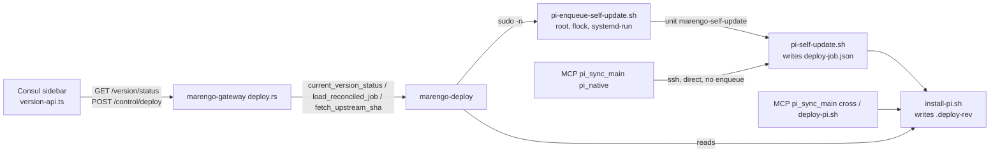

# Intent card: `marengo-deploy`

## 1. Header

| Field | Value |
|---|---|
| Crate | `marengo-deploy` |
| Path | `crates/marengo-deploy` |
| Kind | lib |
| Baseline | `a2b55b3` |
| LOC | src 1,048 (`job.rs` 306, `status.rs` 268, `upstream.rs` 209, `rev.rs` 97, `enqueue.rs` 61, `paths.rs` 45, `lib.rs` 36, `error.rs` 26); tests/ 59 (`job_script_contract.rs`) + 3 JSON fixtures; 11 unit tests (`metrics/test-counts.md`) + 4 contract tests |
| Sources consulted | `src/lib.rs` //! docs; `Cargo.toml` description; crates/AGENTS.md:24; crates/codemap.md:24 (no per-crate codemap.md exists); gateway.md design concerns 9, 10, 14; finding-index F20, T01, T10, T11; test-quality-plan.md:72; ledger; `git log -- crates/marengo-deploy` (`73992cd`, `289813b`); drivers `bins/marengo-gateway/src/{deploy,main,restart,http}.rs`, `scripts/pi-enqueue-self-update.sh`, `scripts/pi-self-update.sh`, `scripts/install-pi.sh`, `tools/marengo-pi-mcp/src/tools/deploy.ts`, `consul/src/lib/version-api.ts`, `consul/src/components/dashboard/sidebar/use-sidebar-self-update.ts`; `metrics/*` |

## 2. Intent

`marengo-deploy` holds the **domain logic for the Pi self-update lifecycle and the installed-version status** shown in Consul's sidebar (`lib.rs:1-11`; commit `73992cd` "sidebar version status with Pi self-update (#136)"). It owns:
- The on-disk job ledger `var/deploy-job.json`: schema, atomic write, reconciliation of stale or orphaned `running` jobs (`job.rs`).
- Parsing of `.deploy-rev` (`rev.rs`).
- The cached GitHub tip of `main` (`upstream.rs`).
- A single derived `UpdateUiState` (`status.rs`).
- Enqueueing a self-update through the root-owned helper `pi-enqueue-self-update.sh` via `sudo -n` (`enqueue.rs`; `paths.rs:3`).

It was extracted from gateway HTTP code to give the gateway "thin HTTP adapters" (`bins/marengo-gateway/src/deploy.rs:1`). gateway.md design concern 14 calls it "a useful start" toward deep modules. The job JSON schema is shared with shell scripts, and the crate doc names `tests/job_script_contract.rs` as the alignment guard (`lib.rs:9-11`).

**Who drives deploy jobs:**

Evidence for the diagram:
- Routes: `bins/marengo-gateway/src/http.rs:153-154`; `consul/src/lib/version-api.ts:135,153`.
- Enqueue: `enqueue.rs:27-61`; `scripts/pi-enqueue-self-update.sh:82-86,124-147`.
- Self-update script writes the job file: `scripts/pi-self-update.sh:41-70,153`.
- `.deploy-rev`: `scripts/install-pi.sh:353-354`.
- MCP: `tools/marengo-pi-mcp/src/tools/deploy.ts:43-76,199-217`.
- Gateway boot: `bins/marengo-gateway/src/main.rs:214` (`init_upstream_cache_from_disk`).

Conflicting statements of intent:
- `lib.rs:4-6` says the crate owns "deploy-job persistence and reconciliation". The scripts also write the same file independently: the Python writer in `pi-enqueue-self-update.sh:88-120` and the heredoc writer in `pi-self-update.sh:41-70`. The crate is one of **three writers**, and there is no shared lock (§10).
- Status "readiness" is only `.deploy-rev` SHA match plus `www/index.html` existence (`status.rs:85-90`). gateway.md concern 9 says that is file readiness, not service readiness. The crate doc implies authoritative status (`status.rs:54` "single authoritative UI state").

## 3. Owns / Must not

| Owns | Evidence |
|---|---|
| `DeployJob` schema (state, phase incl. forward-compatible `Unknown`) | `job.rs:14-76` |
| Read (missing → Idle, corrupt → Failed sentinel), atomic tmp+rename write | `job.rs:89-139` |
| Reconciliation: running→succeeded on SHA match; →failed(timeout) after 30 min; →failed(orphan) if unit inactive >120 s | `job.rs:11-12,177-209` |
| `.deploy-rev` parse (`SHA [ISO]`), prefix SHA match (≥7 hex) | `rev.rs:10-58` |
| Upstream tip via `curl` GitHub API, 60 s TTL memory + disk cache, single-flight async lock, env override | `upstream.rs:13-209` |
| UI state derivation + side-effecting demotion Succeeded→Failed when `www` missing | `status.rs:38-153` |
| Enqueue via `sudo -n <helper> <sha> <job_id>` with 30 s timeout | `enqueue.rs:26-61` |
| Path resolution + privileged helper dir constant | `paths.rs:1-45` |

| Must not (`lib.rs:8-10`) | Violation? |
|---|---|
| HTTP routing / Axum | None. No axum dependency (`Cargo.toml:13-19`). |
| Gateway authentication | None. Auth is absent at the route as well (G07 scope). |
| SharedState safety gates (motors ACTIVE, persist pending) | None. Gates live in gateway `deploy.rs:90-119`. |
| Consul UI behavior | **Borderline.** `UpdateUiState` encodes sidebar presentation (`status.rs:10-20`) and the demotion message text tells the operator to "retry Update after building Consul" (`status.rs:115-117`). |
| Owning the restart helper | `paths::PRIVILEGED_HELPERS_DIR` is reused by gateway restart (`bins/marengo-gateway/src/restart.rs:69`): a cross-concern leak, harmless. |

## 4. Interface

| Concept | Public surface | Consumers |
|---|---|---|
| Status | `current_version_status`, `VersionStatus`, `UpdateUiState`; `assemble_version_status`, `derive_ui_state`, `ready_for_target` | gateway `deploy.rs:11,52,57`. `assemble_version_status`, `derive_ui_state`, `ready_for_target`: only crate tests. |
| Control | `load_reconciled_job`, `fetch_upstream_sha`, `enqueue_self_update`, `new_job_id`, `shas_match`, `web_root_ready`, `DeployJobState` | gateway `deploy.rs:11-12,121,135,150,162-163` |
| Boot | `init_upstream_cache_from_disk` | gateway `main.rs:214` |
| Job file | `read_job_file`, `read_job_file_strict`, `JobFileRead`, `write_job_file`, `reconcile_job`, `DeployJob`, `DeployPhase`, `DEPLOY_JOB_MAX_AGE_SECS` | external: contract test only (`tests/job_script_contract.rs:5`). `read_job_file_strict`/`JobFileRead`: **no production caller** (§10 lead 2). |
| Rev | `parse_deploy_rev`, `read_deploy_rev`, `ParsedDeployRev` | crate-internal + tests. No external caller; host-metrics re-implements it (`marengo-host-metrics/src/lib.rs:36-42`). |
| Paths | `resolve_{deploy_rev_path,job_file_path,enqueue_script,upstream_cache_path,self_update_log_path}`, `paths::PRIVILEGED_HELPERS_DIR` | internal; gateway `restart.rs:69` (const only) |
| Errors | `DeployError`, `Result` | gateway `deploy.rs:176-187` (Display only) |

Cargo features: none. Depth: **medium**. `current_version_status` is deep (reads rev, reconciles, writes back, fetches upstream, assembles). The other exports are shallow pass-throughs that expose internals the only consumer doesn't need. Seams: none. Clock (`SystemTime`), filesystem (env-resolved paths), `systemctl`, `curl` and `sudo` are all ambient, which is why `enqueue.rs` and `upstream.rs` have 0 % coverage. Tests rely on env overrides (`MARENGO_*` paths, `MARENGO_UPSTREAM_SHA`, `MARENGO_SKIP_WWW_READY`).

**Metrics baseline** (`metrics/`, `a2b55b3`, macOS):
- Crate coverage is **49.3 / 48.6 / 40.5 %**, the lowest library crate (`coverage-by-crate.md`).
- By file: `enqueue.rs` **0.0 %** (0/41), `upstream.rs` **0.0 %** (0/159), `job.rs` 73.9 %, `status.rs` 81.9 %, `rev.rs` 81.5 % (`coverage-by-file.md`).
- Suppressed results: `job.rs:217`, `status.rs:119`, `upstream.rs:70` (`suppressions.md`).

## 5. Invariants owned

| Invariant | Enforcing code | Test(s) |
|---|---|---|
| Corrupt job file never reads as Idle | `job.rs:107-119` | `job.rs:297` `corrupt_job_file_fails_closed_not_idle` |
| Unknown future phase is readable | `job.rs:47-48` | `job.rs:290`; `tests/job_script_contract.rs:37` |
| Running job promoted only when installed SHA matches target | `job.rs:182-189` | `job.rs:244` |
| Running job older than 30 min → failed | `job.rs:190-197` | `job.rs:257` |
| Orphan (unit inactive >120 s) → failed | `job.rs:198-207` | **untested** (shells out to `systemctl`) |
| Atomic job write (tmp+rename) | `job.rs:122-139` | `job.rs:271` (roundtrip only; atomicity untested) |
| UI never sticks in Updating after a terminal state; Failed+behind → Stale (retry allowed) | `status.rs:55-73` | `status.rs:188,215` |
| Succeeded without servable `www` is demoted to Failed (persisted) | `status.rs:109-120` | `status.rs:188` (UI state); persistence side effect untested |
| SHA prefix match requires ≥7 chars on both sides | `rev.rs:37-47` | `rev.rs:75` |
| Upstream fetch single-flight + TTL | `upstream.rs:87-101` | **untested** (0 %) |
| Enqueue bounded at 30 s; non-zero exit surfaced (≤500 chars) | `enqueue.rs:48-59` | **untested** (0 %) |
| Script-written JSON deserializes as `DeployJob` | serde schema | `tests/job_script_contract.rs:12-34`, but on **hand-written fixtures**, not script output (test-quality-plan.md:72) |
| Gateway refuses deploy while ACTIVE+fresh or persist pending | gateway `deploy.rs:90-119` (not this crate) | gateway tests (out of scope) |

## 6. Inputs / outputs

- **Env:**
  - Paths: `MARENGO_ROOT` (default `/opt/marengo`), `MARENGO_DEPLOY_REV_PATH`, `MARENGO_DEPLOY_JOB_FILE`, `MARENGO_SELF_UPDATE_ENQUEUE_CMD`, `MARENGO_UPSTREAM_CACHE_PATH`, `MARENGO_SELF_UPDATE_LOG` (`paths.rs:11-45`).
  - Behavior: `MARENGO_SELF_UPDATE_SKIP_SUDO` (`enqueue.rs:33-36`), `MARENGO_GITHUB_REPO` (default `jaylamping/marengo`), `MARENGO_GITHUB_REF` (default `main`), `GITHUB_TOKEN`, `MARENGO_UPSTREAM_SHA` (`upstream.rs:41-53,75,158`), `MARENGO_SKIP_WWW_READY` (`status.rs:161`).
- **Files:**
  - Read: `.deploy-rev`.
  - Read and write: `var/deploy-job.json` (+ `.json.tmp`), `var/upstream-sha.json`.
  - Read: `var/self-update.log` (last 4000 B on failure), `www/index.html` (exists?) (`status.rs:148,155-171`).
- **Processes:**
  - `sudo -n /usr/local/libexec/marengo/pi-enqueue-self-update.sh <sha> <job_id>` (`enqueue.rs:43-44`; `paths.rs:3,30-33`).
  - `systemctl is-active --quiet <unit>.service` (`job.rs:222-235`).
  - `curl -fsSL … https://api.github.com/repos/<repo>/commits/<ref>`, 15 s max-time, 20 s timeout (`upstream.rs:144-187`).
- **HTTP (via gateway):** `GET /version/status[?refresh=1]`, `POST /control/deploy {confirm:true}` (`bins/marengo-gateway/src/http.rs:153-154`; `deploy.rs:50-189`).
- No Chappe, CAN or config YAML.

## 7. Prior review reconciliation

| Prior ID | Status | Evidence |
|---|---|---|
| gateway.md concern 9: readiness = rev + www only; reconcile/status writes can overwrite a newer enqueue | **Open** | `status.rs:85-90` (`_job` unused); `job.rs:212-219` and `status.rs:112-120` write without lock or job-ID compare-and-swap |
| gateway.md concern 10: enqueue timeout without `kill_on_drop` | **Open** | `enqueue.rs:38-51`. No `kill_on_drop(true)`; on timeout the `sudo` child keeps running and may enqueue after HTTP 500. The same applies to `curl` (`upstream.rs:148-169`). |
| F20 (P2) self-update success from another job's target | **Open** (ledger). Crate side: status does not bind to job ID (`status.rs:104-110`). The Consul hook compares `job_id` only when present (`consul/src/components/dashboard/sidebar/use-sidebar-self-update.ts:70`). | ledger F20 open |
| T01 (P1) root helpers replaceable via writable dirs | **Partial** (ledger, batch29). Crate-relevant change: `PRIVILEGED_HELPERS_DIR=/usr/local/libexec/marengo` (`paths.rs:3`; commit `289813b`). | ledger T01 partial |
| T10/T11 MCP build/git in runtime dir; cross deploy switches checkout | **Open** (MCP-owned, not this crate) | ledger |
| test-quality-plan.md:72 contract test proves hand-authored JSON, not script output | **Open** | `tests/job_script_contract.rs:13,23,30` use `include_str!("fixtures/…")` |
| gateway.md:10 "15 passed (11 unit, 4 contract)" | **Unchanged** | 11 unit (`metrics/test-counts.md`) + 4 in `tests/job_script_contract.rs` |

## 8. Drift

| Doc | Code |
|---|---|
| Repo convention: every other crate has `codemap.md` (+ `src/codemap.md`), and crates/codemap.md:24 indexes this crate | `crates/marengo-deploy/` has **no** `codemap.md` or `src/codemap.md`. |
| `lib.rs:10-11` "`scripts/pi-*-self-update.sh` must stay aligned (see `tests/job_script_contract.rs`)" | The test never executes or parses the scripts; fixtures are static. The scripts emit `started_at` and `unit_name` differently (MCP path sets no `MARENGO_SELF_UPDATE_UNIT`, so `unit_name: ""`, `pi-self-update.sh:12,56`). |
| `job.rs:85` `JobFileRead::Corrupt` "fail closed for enqueue" | Enqueue path uses `load_reconciled_job` → `read_job_file` (coercing). Corrupt becomes `Failed`, which does **not** block enqueue (`bins/marengo-gateway/src/deploy.rs:121-133`). `read_job_file_strict` has no production caller. |
| `status.rs:75` "True when Consul `www/index.html` is present (or readiness check skipped)" | Accurate, but `ready_for_target` doc (`status.rs:80-84`) admits the job argument is ignored. |
| `status.rs:54` "single authoritative UI state" | Consul still carries "Legacy inference — remove once all Pi gateways serve ui_state" (`use-sidebar-self-update.ts:129`). |
| crates/AGENTS.md:24 "Self-update jobs, revisions, upstream status, and enqueueing" | Accurate. |

## 9. Prune candidates

| Candidate | Evidence class | Confidence | Deleting it touches |
|---|---|---|---|
| `ready_for_target` `_job` parameter | Dead parameter (documented as retained for interface only, `status.rs:80-85`) | high | `status.rs:85,109`; tests |
| `read_job_file_strict` + `JobFileRead` as public API | Scaffold with no production consumer. Either wire it into the enqueue gate (gap, §10 lead 2) or fold it into `read_job_file`. | med (prefer wiring, not deleting) | `job.rs:78-105`, `lib.rs:24-25` |
| Public re-exports `assemble_version_status`, `derive_ui_state`, `ready_for_target`, `reconcile_job`, `write_job_file`, `parse_deploy_rev`, `read_deploy_rev`, `ParsedDeployRev`, `resolve_*`, `UPSTREAM_CACHE_TTL_SECS`, `DEPLOY_JOB_MAX_AGE_SECS` | Zero external consumers (gateway uses 9 symbols, `deploy.rs:10-13`, `main.rs:214`, `restart.rs:69`); tests only | med (narrow to `pub(crate)`, keep testable) | `lib.rs:21-36`; contract test uses `DeployJob*` only |
| `pub mod enqueue/job/paths/rev/status/upstream` **and** flat re-exports | Duplicate surface: two public paths for each symbol | med | `lib.rs:13-19` |
| `web_root_ready()` wrapper around private `www_index_present()` | Shallow duplicate | low | `status.rs:76-78,155-162` |
| `host-metrics::read_deploy_rev` (other crate) | Duplicate implementation of `rev::read_deploy_rev` | med | see marengo-host-metrics card |
| Consul legacy UI-state inference (other module) | Superseded by `ui_state` (`use-sidebar-self-update.ts:129`) | med | Consul only |

Not prunable: the corrupt→Failed sentinel, the 30 min/120 s reconciliation, and the motors-ACTIVE gate (gateway). These are fail-closed paths.

## 10. Phase-B leads

1. **Three uncoordinated writers of `deploy-job.json`.** The gateway (`job.rs:216-217`, `status.rs:112-120`), the enqueue helper (`pi-enqueue-self-update.sh:88-120`) and `pi-self-update.sh:41-70` share no lock. A status poll that reconciles or demotes can overwrite a just-written `running` job or a newer phase (read-modify-write between `job.rs:215` and `:217`). Write errors are discarded (`metrics/suppressions.md`: `job.rs:217`, `status.rs:119`).
2. **Corrupt job file does not block enqueue**, contrary to `job.rs:85`. See §8. Verify whether the helper's own `systemctl is-active` check (`pi-enqueue-self-update.sh:64-67`) is the only remaining guard.
3. **Blocking calls in async handlers.** `load_reconciled_job` runs `std::process::Command("systemctl")` and blocking file I/O inside `async fn current_version_status` and `post_control_deploy` (`job.rs:212-235`; `status.rs:145`; `bins/marengo-gateway/src/deploy.rs:121`). It runs on Tokio workers on every sidebar poll.
4. **No negative caching of upstream failures.** On curl failure the memory cache keeps its old `fetched_at` (`upstream.rs:113-124`), so `cache_is_fresh` stays false. Every subsequent status request re-runs `curl` for up to 20 s, serialized by the async lock (`upstream.rs:94`), and all sidebar polls queue behind it while GitHub is unreachable.
5. **Token on the command line.** `GITHUB_TOKEN` is passed as a `-H` argument (`upstream.rs:158-163`), visible in `/proc/<pid>/cmdline` to other Pi users while curl runs.
6. **Timeout without kill** (`enqueue.rs:48-51`, `upstream.rs:166-169`; concern 10). The enqueue helper may complete after the gateway reported failure. The operator retries, and `pi-enqueue-self-update.sh:64-67,83-86` then rejects it. The UI shows a failure for a job that is running.
7. **Running job with unparseable `started_at` and empty `unit_name` never times out** (`job.rs:190-207`: `started=0` skips both age checks). The MCP direct path writes `unit_name: ""` (`pi-self-update.sh:12,56`; MCP sets no `MARENGO_SELF_UPDATE_UNIT`, `tools/marengo-pi-mcp/src/tools/deploy.ts:62-67`). Orphan detection is therefore disabled for MCP-driven updates, and a malformed timestamp wedges `Updating` forever.
8. **MCP bypasses the enqueue lock.** `pi_sync_main pi_native` runs `pi-self-update.sh` directly over SSH (`deploy.ts:62-76`). The root `flock` and `marengo-self-update` unit check (`pi-enqueue-self-update.sh:64-86`) and the gateway's in-process `DEPLOY_LOCK` (`bins/marengo-gateway/src/deploy.rs:21-25,77`) are not taken, so a Consul Update can start concurrently with an MCP deploy.
9. **Status "success" = SHA prefix + file exists** (`status.rs:85-90,109-110`). It verifies neither gateway/pi startup nor the www bundle version (concern 9 / F20). `shas_match` accepts any ≥7-char prefix both ways (`rev.rs:43-44`), so a short or edited `.deploy-rev` prefix matches.
10. **`parse_deploy_rev` strips literal `\n` sequences** (`rev.rs:14`). A non-hex first token returns the whole line as `sha` (`rev.rs:30-33`), which then feeds `shas_match` and yields Stale or Unknown rather than an explicit parse error.
11. **Non-durable atomic write.** No `fsync` of the file or directory before or after rename (`job.rs:130-138`), so power loss after "succeeded" can resurrect an older state [INFERENCE].
12. **Coverage gap on side-effecting paths** (`metrics/coverage-by-file.md`): `enqueue.rs` 0 %, `upstream.rs` 0 %, the orphan branch of `job.rs` untested. These are gaps, not prune signals: they hold the fail-closed timeouts.
