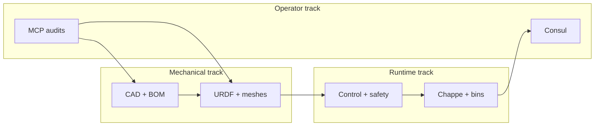

# Marengo roadmap

**North star:** a **23-DOF biped humanoid** (~1524 mm, ~38–42 kg, no dexterous hands in v1). One repo holds mechanical truth, runtime, and operator tooling for the **whole machine**.

**Current progress:** the **left/right arm chain (4-DOF bring-up slice)** and **upper torso 2020 frame** are furthest along in CAD and software. That slice is **not** a separate robot—it is the first subsystem we can bench, audit, and harden while the rest of the body is designed and commissioned.

| Doc | Role |
|-----|------|
| [hardware/docs/kinematics.md](../hardware/docs/kinematics.md) | Joint names, limits, actuator map (humanoid SSOT) |
| [hardware/docs/torso-design-handoff.md](../hardware/docs/torso-design-handoff.md) | Torso CAD context and committed frame dims |
| [docs/architecture.md](architecture.md) | Software crate boundaries |
| [docs/safety.md](safety.md) | Bench and enable rules (read before motors) |
| [config/robot_humanoid.yaml](../config/robot_humanoid.yaml) | Full-body config template (not active runtime yet) |
| [config/robot.yaml](../config/robot.yaml) | **Active** bring-up config (4-DOF arm subset) |

---

## Product definition (v1)

| Item | Target |
|------|--------|
| Form | Biped, no wheels |
| Height | 1524 mm standing |
| DOF | 23 actuated (no hands); head skipped in v1 CAD |
| Actuators | RS04 hips/knees; RS03 waist/hips/shoulders; RS02 ankles + arm distal |
| Proportions | G1 upper body, R1-class slim legs |
| Structure | 2020 aluminum torso cage (committed); pelvis/legs/shell largely draft |
| Comms / runtime | Pi (control + CAN), Jetson (planner + perception), Chappe protobuf bus |
| Software path | Berthier → Davout → robstride (fixed; see [safety.md](safety.md)) |

---

## How to read this roadmap

Three **parallel tracks** advance the same humanoid. They do not finish in lockstep—only the **gates** at the bottom block unsafe or wasteful work.

**Execution slice (today):** 4-DOF arm bench + torso frame rev A. Software defaults (`config/robot.yaml`, `arm_4dof.urdf`) exist so we can prove gravity compensation, Davout limits, and CAN on **real joints** without waiting for legs or pelvis.

**Humanoid templates already in repo:** `robot_humanoid.yaml`, `motors_humanoid.yaml`, placeholder `marengo.urdf`, proto types, and config validation tests. Use them for **naming and CI alignment**, not for bench enable until URDF/CAD for those joints exist.

### Arm slice → humanoid arm mapping

Bring-up joint names are a **subset** of the left-arm humanoid names (same axes/limits intent):

| Bring-up (`robot.yaml`) | Humanoid (`robot_humanoid.yaml`) |
|-------------------------|----------------------------------|
| `shoulder_roll` | `left_shoulder_roll` (mirror for right) |
| `shoulder_pitch` | `left_shoulder_pitch` |
| `upper_arm_yaw` | `left_upper_arm_yaw` |
| `elbow` | `left_elbow` |

Wrists and the right arm are commissioned when CAD and CAN topology include them.

---

## Milestones

Statuses: **done** · **active** · **next** · **later**

### M1 — Repository and architecture baseline

**Status:** done

- Workspace layout, ADRs, CI (`just check`), containerized dev
- Crate boundaries: Berthier / Davout / robstride / Chappe / proto
- Humanoid kinematics SSOT and humanoid config templates
- SolidWorks MCP audit tools (read-first; destructive CAD opt-in)

### M2 — Mechanical: torso and vendor truth

**Status:** active

**Goal:** committed upper torso cage, layout skeleton, RS03 bracket direction, vendor STEP in tree.

| Deliverable | Reference |
|-------------|-----------|
| 2020 frame assembly frozen | `marengo_torso_frame_asm_revA`, [torso-2020-extrusion.md](../hardware/docs/torso-2020-extrusion.md) |
| Layout part with named URDF refs | `marengo_torso_layout_revA`, [cad-standards.md](../hardware/docs/cad-standards.md) |
| Shoulder/waist RS03 brackets rev A | [torso-actuator-brackets-revA.md](../hardware/docs/torso-actuator-brackets-revA.md) |
| MCP design review clean | `marengo_design_review`, `marengo_urdf_readiness` |
| Root assembly tree | `hardware/cad/assemblies/marengo.SLDASM` |

**Parallel (draft, safe to iterate):** pelvis ring, shell, battery bays, hip splay, leg segments—see [torso-design-handoff.md](../hardware/docs/torso-design-handoff.md).

### M3 — Mechanical: limbs and full URDF export

**Status:** next (after M2 torso stable)

**Goal:** `assets/urdf/marengo.urdf` and meshes replace placeholders; Brawner export + [export-urdf.sh](../scripts/export-urdf.sh) + MCP `marengo_urdf_export_postcheck`.

| Subsystem | DOF | Notes |
|-----------|-----|-------|
| Legs (×2) | 12 | RS04 pitch/knee first for sign tests under load |
| Arms (×2) | 10 | Extend 4-DOF bring-up; add wrists last on arm chain |
| Waist | 1 | RS03 in committed waist bay |
| Head | — | v1 CAD skipped; stub links OK in URDF |

### M4 — Runtime: prove control stack on hardware (arm slice)

**Status:** active (software); blocked on real CAN + arm CAD masses

**Goal:** same stack that will run the humanoid, exercised on the **4-DOF slice** first.

| Step | Done when |
|------|-----------|
| SocketCAN wired in `marengo-pi` / `motor-repl` (config-selectable; keep `MemoryBus` in CI) | Bench on `vcan0` then robot CAN |
| GravityComp on arm | [safety.md](safety.md) upright-pose procedure passes |
| Davout limits + danger zones | No runaway on shoulder_pitch / elbow |
| `arm_4dof.urdf` masses from CAD export | Dynamics tests match hardware feel |

**Do not** treat MemoryBus-only `marengo-pi` as “shipped”—it is a loop scaffold until M4 CAN is wired.

### M5 — Electrical and CAN topology

**Status:** next

**Goal:** documented harness, Pi/Jetson roles, motor IDs in [motors_humanoid.yaml](../config/motors_humanoid.yaml), bring-up order per subsystem.

- CAN1 Robstride (see [hardware ADR 0001](../hardware/docs/decisions/0001-can-and-motors.md))
- E-stop and enable semantics reflected in Davout + proto `SafetyState`
- Commission joints in **dependency order:** waist → one leg (pitch/knee) → ankles → second leg → arms

### M6 — Full-body config switch

**Status:** later

**Goal:** runtime uses humanoid URDF and joint list end-to-end (still with bench caps).

1. Replace `config/robot.yaml` pointer (or deploy overlay) to `robot_humanoid.yaml` / `motors_humanoid.yaml`
2. Per-joint enable in Davout; no “humanoid code path” fork—same Berthier loop, more joints
3. Sim: regenerate MJCF from production URDF; extend `sim-harness` beyond minimal fixture

### M7 — Multi-process runtime and operator UI

**Status:** later

| Piece | Gate |
|-------|------|
| Chappe transport ADR (NATS/IPC vs in-process) | Required before Pi + Jetson + Consul are separate processes |
| Consul minimal UI (state, enable, faults, URDF viz) | After Chappe carries real `RobotState` / `SafetyState` |
| `marengo-jetson` beyond scaffold | After M6 or clear sim-only planner scope |
| Talleyrand | After collision meshes + stable full URDF |
| Fouché / `models/` | After Jetson role and ONNX scope defined |

### M8 — Locomotion and whole-body behaviors

**Status:** later

- Standing / balance (ankle RS02 tuning, CoM from real masses)
- Gait or stepping (Talleyrand + sim D2; Isaac out of band per [ADR 0003](decisions/0003-simulation-testing.md))
- Teleop ([bins/teleop](../bins/teleop)) — explicitly **after** unilateral arm G-comp on hardware

---

## What we are not building (v1)

- Dexterous hands (stub links only)
- Hourglass / non-athletic shell aesthetic as a design driver
- JSON on Chappe wire ([ADR 0001](decisions/0001-protobuf-wire-types.md))
- Direct `robstride` calls from Berthier or bins
- MCP destructive CAD without explicit user `confirm`
- Control policies tuned against the **2-DOF** `marengo.urdf` placeholder

---

## Decision gates (before adding code)

Use these to avoid throwaway work:

1. **New joint in runtime?** Named in `kinematics.md`, present in exported URDF, motor row in `motors_humanoid.yaml`, Davout limits derivable.
2. **New crate feature?** Fits [architecture.md](architecture.md) boundary; if it touches motors, read [safety.md](safety.md).
3. **New proto field?** Change `proto/` first; regen Rust + Consul; buf breaking on PR.
4. **New CAD automation?** Audit tools first; write tools only with confirm and handoff doc update.
5. **Humanoid-only behavior?** Prefer data-driven joint list from config over a second control loop.

---

## CAD / repo hygiene (ongoing)

- One canonical assembly per rev; avoid committing `*-OLD` / `*-BROKEN-*` long term (use git history).
- Assembly path in manifests matches on-disk casing: `marengo.SLDASM`.
- Placeholder assets (`marengo.urdf`, missing `assets/meshes/`) must not drive tuning—track against M3 export.

---

## Suggested focus (next 4–8 weeks)

| Priority | Track | Action |
|----------|-------|--------|
| 1 | Mechanical | Close torso frame + layout refs; MCP design review |
| 2 | Runtime | Wire SocketCAN; bench 4-DOF G-comp per safety doc |
| 3 | Mechanical | Export arm URDF/masses; refresh `arm_4dof.urdf` |
| 4 | Mechanical | Pelvis + one leg CAD slice for M3 |
| 5 | Docs | Update this file when a milestone status changes |

---

## Related ADRs

| ADR | Topic |
|-----|-------|
| [0001](decisions/0001-protobuf-wire-types.md) | Protobuf wire format |
| [0002](decisions/0002-containerized-dev.md) | Docker / `just check` |
| [0003](decisions/0003-simulation-testing.md) | Sim tiers D0–D2 |
| [0004](decisions/0004-control-modes-and-mit.md) | MIT / gravity comp |
| [0005](decisions/0005-dynamics-library.md) | URDF gravity model |

When a milestone completes, update **Status** here and add a one-line note in the PR or commit message—not a separate plan file.
